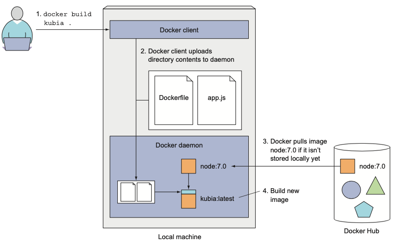

## $ docker build 時の動き


```sh
$ docker build .

Uploading context 10240 bytes
Step 1/3 : FROM busybox
Pulling repository busybox
 ---> e9aa60c60128MB/2.284 MB (100%) endpoint: https://cdn-registry-1.docker.io/v1/
Step 2/3 : RUN ls -lh /
 ---> Running in 9c9e81692ae9

```

* パスは '.'
* ローカルディレクトリのすべてのファイルは tar される
* →Docker daemonに送られる


# Dockerファイル
* Docker Image をビルドするための指示を設定するファイル
* Dockerファイルの各指示が、DockerImageに新たなレイヤーを追加する。

* ビルドコマンドは`docker build docker_file`


## Dockerfile内の各指示が、新規レイヤー追加、Image コミットのポイントとなる
* 各指示がコンテナに変更を加える
* →新規レイヤーに対し docker commit に類する処理をする

```sh
# ベースとなるイメージを指定
FROM ubuntu:16.04
# Image のオーナーを設定
MAINTAINER Yasuaki Shibata "shivaq777@gmail.com"
# 上記指示の結果として、新規コンテナが生成される
# 新規コンテナに対し、変更 →コミット →新規コンテナを run が繰り返される
RUN apt-get update; apt-get install -y nginx
RUN echo 'Hi, I am in your container'\
>/var/www/html/index.html
EXPOSE 80
```
