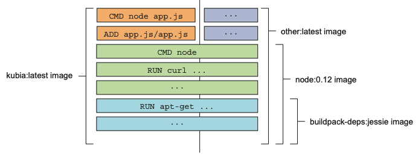

# Layers of a Docker image
* スタックできるファイルシステムのようなもの
* コマンドを実行した結果生成されるファイル
* 複数のイメージが再利用できる
* →ディスク容量、ビルドにかかる時間が削減できる

## レイヤー化する(ユニオンマウントシステムを使う)ことの便益

### 冗長にならない
* union filesystem を使うと、生成された各レイヤーが無制限の数のイメージによって再利用できる

* Imageを使って新規コンテナを作成するたびに、ファイルシステムが改めて生成されることがない

* 結果、Dockerコンテナのインスタンス化が早い
* →ディスク容量とビルド時間が削減できる

### レイヤーの分離
* 読み書きレイヤーによって、イメージを修正可能
* かつ、読み込み専用レイヤーによって、コンテナのintegrityが維持される
* 修正が早くなる。Imageを変更するとき、Dockerは変更がなされたレイヤーのみを更新する

## レイヤーを語るために、Dockerのコンテナを説明する
* Docker のコンテナは、アプリを構成するためのブロック
* 各コンテナは、read-only layersの塊のトップに、readable/writeable layer を乗っけたイメージ

## で、実際レイヤーがどんな仕組みで出来上がっているか
* Union ファイルシステムによって、各レイヤーのファイルをマージ
* →ユニオンマウントポイントにて、一つの 読み取り専用ディレクトリのように見せる
* 異なるレイヤー間で冗長なファイルが有った場合 →高位のレベルのレイヤーのファイルが表示される

## レイヤーがいつ生成されるか
* Docker イメージのビルド時 > Deckerfile 内のコマンドが実行されるときに生成される
* レイヤーは、intermediate images とも呼ばれる
