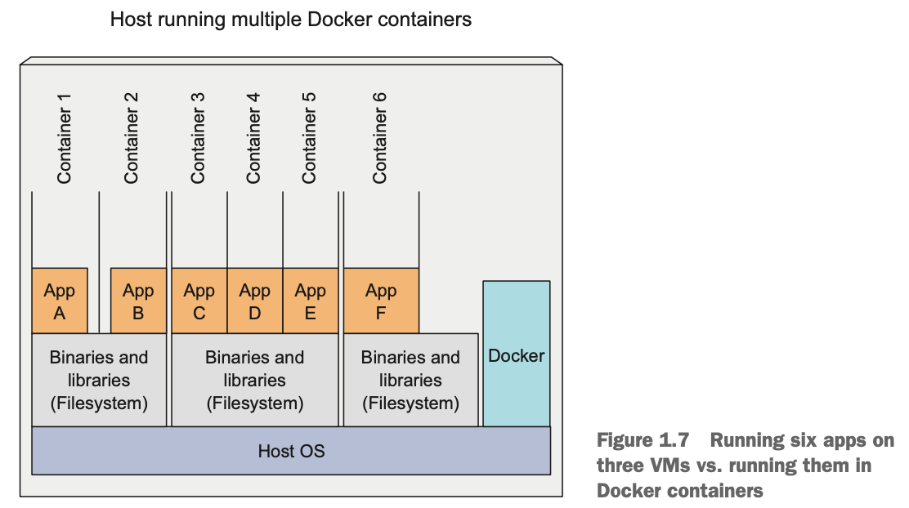

# Imageレイヤー

## 異なるコンテナがファイルシステムを共有

- AppA のコンテナと AppB のコンテナは同じファイルシステムを見ている
- 異なる Docker Image が同じレイヤーを共有することができる
- あらゆる Docker Imageは、他の Image の上に構築される
- 異なる Docker Image に、同じ 親 Image を使う、ということができる
- 結果、ネットワーク越しに Image を配信するスピードが上がる
- 最初の Image の一部として転送sれたレイヤーは、他の Image を転送する際に再転送しなくてもよいから

But layers don’t only make distribution more efficient, they also help reduce the storage footprint of images. 

## ファイルシステムが共有されてても、このように isolation が担保される
- 各レイヤーが格納されるのは1度だけ
- よって同じイメージをベースとする異なるコンテナは、同じファイルを読むことになる
- いずれかのコンテナが、ファイルを更新したとしても、他のコンテナはその変化を見ることはない

- コンテナの Image レイヤーは リードオンリー
- コンテナが実行されると、Image のレイヤーの上に、書き込み可能レイヤーが生成される
- コンテナのプロセスが、レイヤー内のファイルに書き込みを行う際Nine-Patch、最上部のレイヤーに、ファイル全体のコピーが取得される
- プロセスのファイルへの書き込みは、上記コピーに対してなされる
- 結果、コンテナ同士の隔離状態は担保される

