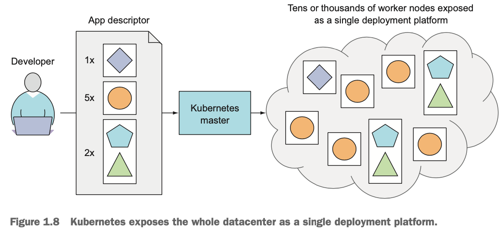

# 発音
rkt (pronounced “rock-it”)

Kubernetes is Greek for pilot or helmsman (the person holding the ship’s steering wheel).
くーばねてぃーｓ
Many pronounce it as Koo-ber-nay-tace,
while others pronounce it more like Koo-ber-netties.

Kubectl
くーべくｔｌ

kubelet
くーばれｔ

k8s, pronounced kates

## どのようにデプロイされるか

- Developer が master に、アプリのリストと、どのアプリは一緒に実行されるか、を指定してアップする。
- どのマシンにどのようにデプロイされるかは、Kubernetes まかせ

## Kubernetes とは
- クラスターの OS のようなもの
- アプリに必要な、インフラ関連の実装をデベロッパの代わりにやってくれる
- Kubernetes はコンテナ化されたアプリをクラスタのどこかで実行する
- Kubernetes が コンポーネントに提供する情報は、コンテナ同士がどうやってそれぞれを見つけるか
- Kubernetes はコンテナ化したアプリたちが実行されつづけることに責任を持つ
- アプリはどのマシン上で動いてもよいので、Kubernetes は自動的に、必要なタイミングで、リソースを有効活用できるようアプリを配置する
- どのようにデプロイするか、について Ops チームがやりくりしなくていい

## Database は入れ替えが難しいため、 Kubernetes には不向き
database replicas are not inter‐ changeable; they each have a unique state, and deploying a database replica requires coordination with other nodes to ensure things like schema changes happen every‐ where at the same time:

## Function as a service のほうがより効率的とも言える
- 短くて、standalone なタスクには向いている

## Clusterless services
### Fargate
- ECS と、EC2のワーカーノードを現在つかっているのなら、スイッチしてもいい
- simple, self-contained, long running compute tasks の場合は、使ってもいい
- カスタマイズや、他のサーバとのやり取りが不要なバッチジョブ(データ処理とか) になら使ってもいい
- それでも、コンテナ構築するのが理想。ワーカーノードのマネージのためのオーバーヘッドが正当化できなかったとしても
~ CLOUD NATIVE DEVOPS-KUBERNETES P.50~

