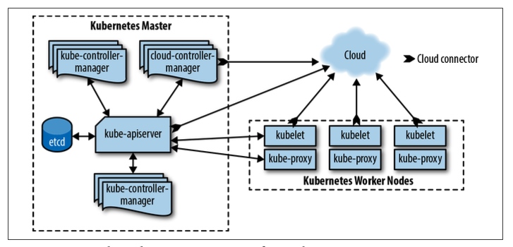
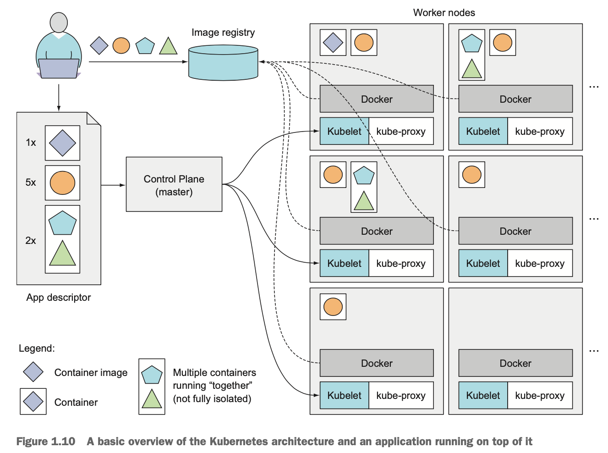

# Master とそのコンポーネントたち
- the Kubernetes Control Plane
- クラスタをコントロールする
- API Descriptor の通りの状態であるかどうか定期的に確認する
- どのサービスをどのコンテナが提供するかを、一つの静的IPアドレスで、クラスタ内のすべてのアプリに expose する
- IPアドレスの expose は環境変数を使って行われる
- アプリ側が DNS でルックアップすることもできる
- サービスを使うコンテナが移動しても、IPアドレスは変わらないので、利用し続けることができる

## Kubernetes API Server
- Control Plane の各コンポーネントを操作するときに使う
- アプリの実行は Worker ノードが行う

## Scheduler

- 一般的な意味でのスケジューリングとは違うことを行う
- 利用可能なリソースをマネージして、最も効率的に実行できるよう、workloads の割当を行う
- Worker ノードをデプロイ可能なアプリのコンポーネントに割り当てる
- Deployment が Replicasets を介して新しいレプリカが必要だと判断すると。。。
- Kubernetes のDB に Pod リソースを作成する
- 上記 Pod は作成と同時にキューに追加される
- Scheduler は、スケジュールされていないキューをWatch し、
- 上記キューから次のPodを取得して、そのPod を動かすNodeを見つける
-  →そして、ワーカーNode 上の Kubelet がコンテナの起動を管理する

※ この文脈でのOrchestration の意味するところ
- サービスの異なる Activity を、共通のゴールを達成するために調整したり、sequencing したりすること

## kube-controller Manager

- クラスタレベルの機能を司る
- コンポーネントのレプリケート、Worker ノードの追跡、ノードの失敗時の処理など

## cloud-controller Manager

- Cloud ベースのクラスタの、Cloud provider と interact する
- LB や ディスクボリュームなどのリソースを管理

## etcd
- 分散データストア
- クラスタの設定を格納している
- なんのノードがいるか、どんなリソースがいるかなど
-------------------------------------------------
# Worker とそのコンポーネントたち

- run the actual applications you deploy

## Container runtime
- Docker, rtt

- コンテナを実行する

## Kubelet
- API サーバーとやり取りする
- ノード内のコンテナを管理する
- ノードのWorkloads を開始したり
- ノードのステータスをモニタリングしたり
- オリジナルの数の半分のレプリカが生きていれば、個々のノードに障害発生しても問題ない
- ノード上の Pod がおかしくなったら、Kubelet が置換を行う

## Kubernetes Service Proxy(kube-proxy)
- アプリのコンポーネント間のトラフィックのロードバランサー
- 別のノード上のPodとの間や
- Pod とインターネットとの間のリクエストをルーティングする

