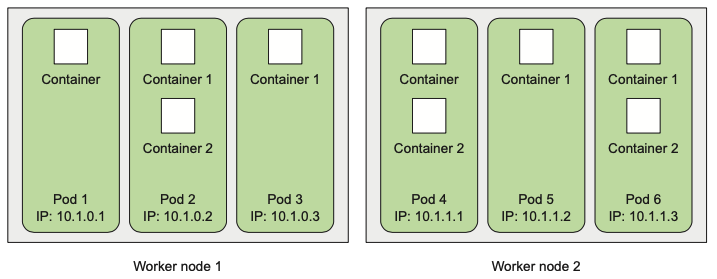

# Pod とは

- A pod is a group of one or more tightly related containers that will always run together on the same worker node and in the same Linux namespace(s). 

- Each pod is like a separate logical machine with its own IP, hostname, processes, and so on, running a single application. 

- The application can be a single process, running in a single container, or it can be a main application process and additional supporting processes, each running in its own container. 

- All the containers in a pod will appear to be running on the same logical machine, whereas containers in other pods, even if they’re running on the same worker node, will appear to be running on a different one.

