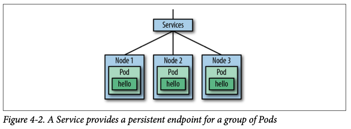

# Pod を作るものとリクエストに対するEntryPointを作るもの
- Deployment は アプリのPod を管理する
- Service はPod へのリクエストの シングルエントリーポイントを提供する

## Deployments
- Pods と ReplicaSet の状態を宣言する
- 実際の状態を、desired 状態に変更する

## Service

- Service は、Backend Pods にリクエストを転送する LB や Web プロキシのようなもの
- クライアントは、Pod ではなく、Service に接続すべき
- pod はそれぞれ異なるプライベートIPアドレスを持つ
- pod は、ヘルシーじゃなくなったり、負荷に余裕ができたりして、置換されることがある
- Service の IP アドレスとポートは(Service のライフタイムの間は)不変です
- Service が、Pod のいずれかがリクエストを受け付けるようにとりはからう
