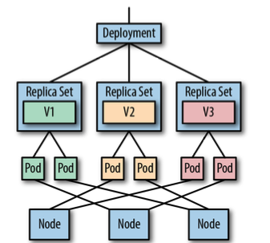
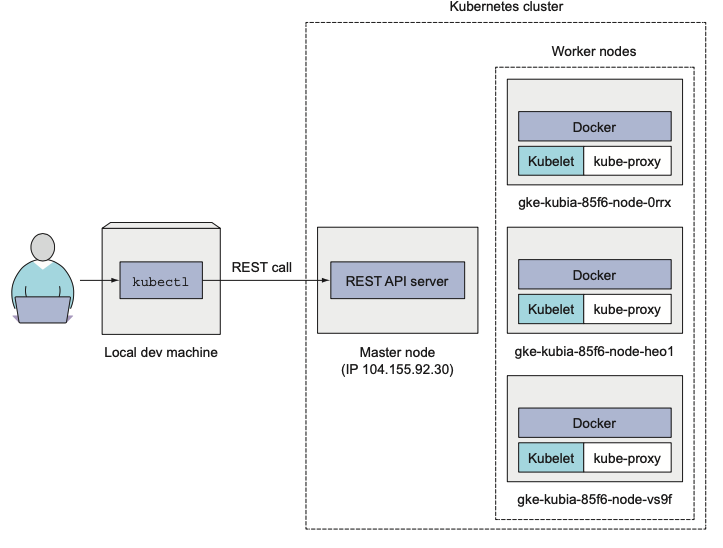
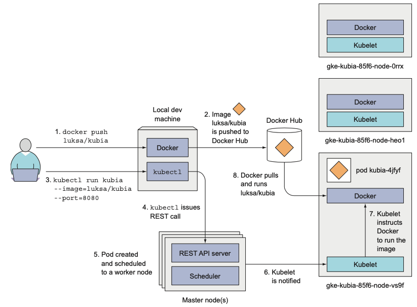
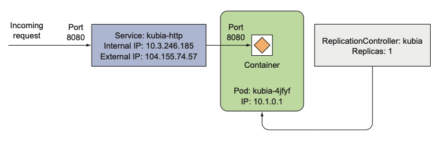

# 作成

## Kubectl で Deployment 作成
```s
# Desired Stateの観点: 「このイメージで、このポートを使うPodを作成」
kubectl run kubia --image=shivaq/kubia --port=8080
```
- kubectl run によって Deployment が作成される
- Deployment がPod を作成
- Deployment は ReplicaSets を管理する
- ReplicaSets によって Pods の状態を管理しつづける(reconciliation loop)
- Deployment がある限り、状態は維持されつづける
- ReplicaSet がどのように Pod のアップデートを行うか、などを管理する
- Update が終わると、古い ReplicaSets と Pods は削除される

## 削除しても、すぐ蘇る
```sh
yasuakishibata@YS-Mac  ~/docker_practice/k8s_practice/practiceB1  kubectl get pods
NAME                    READY   STATUS    RESTARTS   AGE
demo-77b7f7559c-wm54d   1/1     Running   0          4m5s # pod の名前が
 yasuakishibata@YS-Mac  ~/docker_practice/k8s_practice/practiceB1  kubectl delete pods demo-77b7f7559c-wm54d
pod "demo-77b7f7559c-wm54d" deleted # 削除したあとに
 yasuakishibata@YS-Mac  ~/docker_practice/k8s_practice/practiceB1  kubectl get pods
NAME                    READY   STATUS    RESTARTS   AGE
demo-77b7f7559c-qvzbm   1/1     Running   0          6s # すぐ(数秒で)生成され、新しい名前になっている
```


## GKE の場合


## 【gcloud】 で、クラスター作成
- `e2-micro`: vCPU あたり最大 8 GB のメモリで最大 16 個の vCPU を提供するコスト最適化 VM
- `--preemptible`: 最長持続時間が 24 時間で、可用性が保証されない Compute Engine VM インスタンス

gcloud container clusters create kubia --num-nodes 3 --machine-type e2-micro --preemptible


### このような構成のクラスターが作成される


### このようにデプロイされる


## クラスタにアクセスできるように、LBを作成
kubectl expose deployment kubia --type=LoadBalancer --name kubia-http


### このようにサービスが、リクエストを受け付ける
1. 作成した Pod にアクセスできるようにするために、Deployment(Replication Controller) が管理するすべての pods を 単一のサービスとして expose させる



