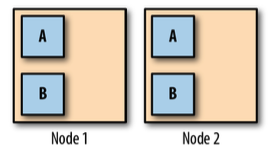
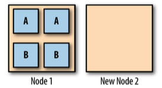
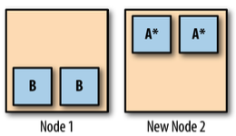

# Workloas が分散されていることを担保する
- Kubernetes の Scheduler が、基本的にはノード間で均等に分散されるように動く

## エッジケース1
- 2つのノード、2つのサービス A と B、それぞれ2つのレプリカがあるとする
- 各サービス、各ノードに均等にレプリカが分散されている

- ノード2 に障害が発生したとする
- Scheduler はレプリカを作成しようとするが、ノードは1つしかないので、唯一のノードにレプリカを作る
- 障害があったノード2 の代わりに、新規ノードを生成するとする。
- しかし、新規ノードにはPodがない状態となる。
- Scheduler は running 状態のPod の移動を行わない

- サービスA のローリングアップデートを行うとする
- Scheduler はサービス A* のレプリカの準備ができたら、古いレプリカを削除する
- 結果、サービスA* は新規ノードにのみ存在することになる
- 可用性が減ずることになる

## エッジケース1 の回避策

- [Descheduler](https://github.com/kubernetes-sigs/descheduler) を使う
- Kubernetes Job で定期的にこのツールを動かす
- 移動がひつようなPod を発見して、リバランスを行わせる
- 例えば
- underutilized(十分にかつようされていない)ノードを見つけ、他のノードのPod を Kill してリスケジュールさせる
- 同じノードで同じPodが動いているやつを見つけて、うまいことやる

