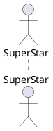
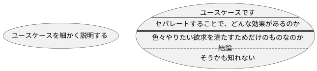
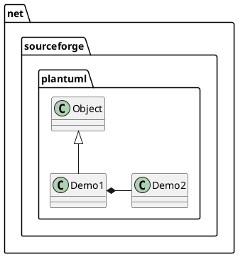
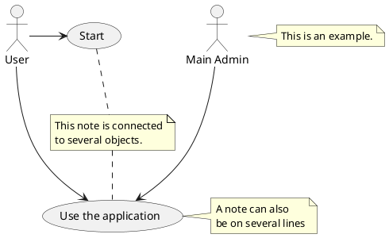
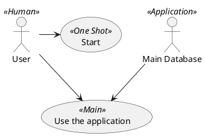
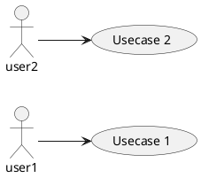

# Actor

* あるシステムの中で役割を演じるあらゆるエンティティが Actor である

* 人間、組織、外部システムが Actor たりうる




# ユースケース

* システム内のアクションまたは機能


# システム

* ユースケースのスコープを表すために使われ、四角で表現される

* オプショナルな要素だが、大きなシステムを可視化する際に有用

* すべてのユースケースを作成し、システム OBJ を使ってそのプロジェクトのスコープを定義する

```plantuml
@startuml

rectangle "Big Brother" {

}

@enduml
```




# パッケージ

* オプショナルな要素

* クラス図と同じ用に、ユースケースをグループ化するのに使える





```PlantUML
@startuml

actor Promoter
actor Entrant


Promoter --> (Create Event)
Promoter -> (Attend Event)

Entrant --> (Find Event)
(Attend Event) <- Entrant

' ..> で extend, include'
(Attend Event) <.. (Create Member)  : <<include>>

@enduml
```


### ノート



### ステレオタイプを記載 << >>



## 左から右


