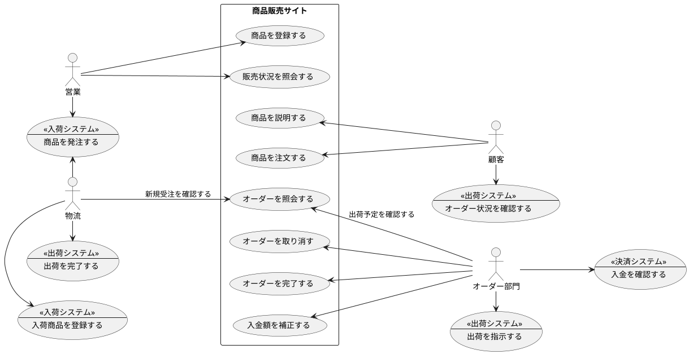
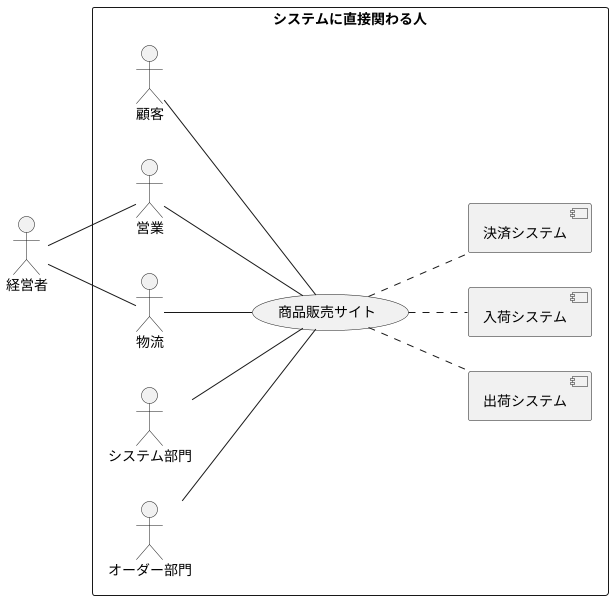

```plantuml
@startuml
left to right direction

actor 営業
actor 物流
actor 顧客
actor オーダー部門

usecase 商品を発注する as "<<入荷システム>>
--
商品を発注する"
営業 -> 商品を発注する
商品を発注する <- 物流

usecase 入荷商品を登録する as "<<入荷システム>>
--
入荷商品を登録する"
物流 -> 入荷商品を登録する

usecase 出荷を完了する as "<<出荷システム>>
--
出荷を完了する"
物流 -> 出荷を完了する

usecase オーダー状況を確認する as "<<出荷システム>>
--
オーダー状況を確認する"
顧客 -> オーダー状況を確認する

usecase 出荷を指示する as "<<出荷システム>>
--
出荷を指示する"
オーダー部門 -> 出荷を指示する

usecase 入金を確認する as "<<決済システム>>
--
入金を確認する"
オーダー部門 --> 入金を確認する

rectangle 商品販売サイト {
  営業 --> (商品を登録する)
  営業 --> (販売状況を照会する)

  (商品を説明する) <-- 顧客
  (商品を注文する) <-- 顧客

  物流 --> (オーダーを照会する) : 新規受注を確認する

  (オーダーを取り消す) <-- オーダー部門
  (オーダーを完了する) <-- オーダー部門
  (オーダーを照会する) <-- オーダー部門 : 出荷予定を確認する
  (入金額を補正する) <-- オーダー部門
}
@enduml

```

```plantuml
@startuml
left to right direction

actor 経営者

rectangle システムに直接関わる人 {
  actor 顧客
  actor 営業
  actor 物流
  actor システム部門
  actor オーダー部門
  経営者 -- 営業
  経営者 -- 物流
  顧客 -- (商品販売サイト)
  営業 -- (商品販売サイト)
  物流 -- (商品販売サイト)
  システム部門 -- (商品販売サイト)
  オーダー部門 -- (商品販売サイト)
  (商品販売サイト) .. [出荷システム]
  (商品販売サイト) .. [入荷システム]
  (商品販売サイト) .. [決済システム]
}
@enduml

```
