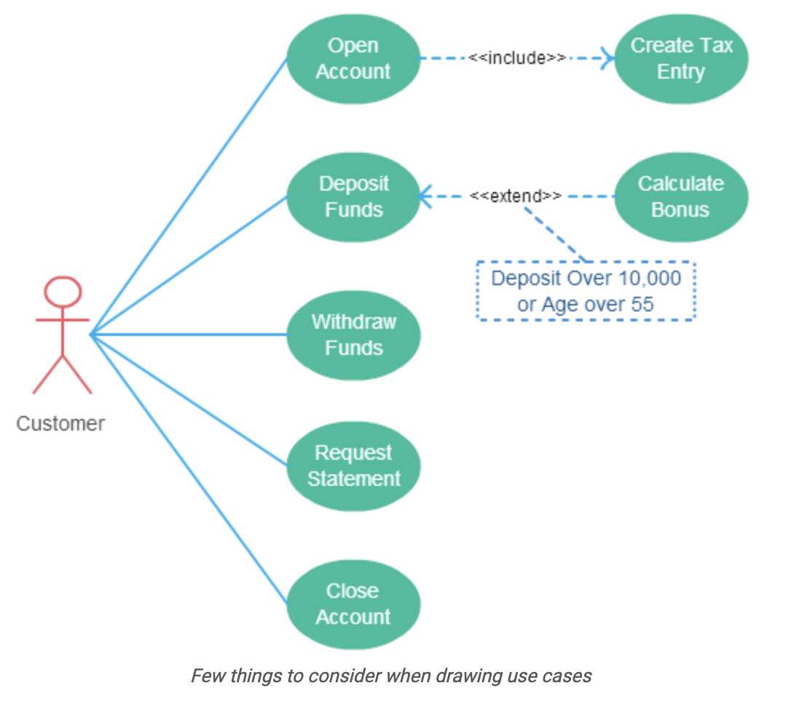

# ユースケースについてのガイドライン

## Names begin with a verb
* ユースケースはアクションをモデル化するものであるがゆえ

## Make the name descriptive
* “Print Invoice”  is better than “Print”.

## Highlight the logical order

* 銀行の利用者の典型的なユースケースを分析する場合、口座作成、預金、引き出しを含むと思う。それらはロジカルな順番で見せるべし


## Place included use cases to the right of the invoking use case

* 可読性とわかりやすさのため


```PlantUML
@startuml

Customer -> (Open Account)
(Open Account) .right.> (Create Tax Entry)  : <<include>>
Customer -> (Deposite Funds)
(Deposite Funds) <.right. (Calculate Bonus)  : <<extend>>
(Open Account) -[hidden]down-> (Deposite Funds)

note "預金が 10000 を超えた\n または \n 年齢が 55 を超えた" as nbonus
(Calculate Bonus) .. nbonus
nbonus .. (Deposite Funds)
@enduml
```
## Place inheriting use case below parent use case

* 可読性とわかりやすさのため
