# アクティビティー図は、プロセスの状態を表現

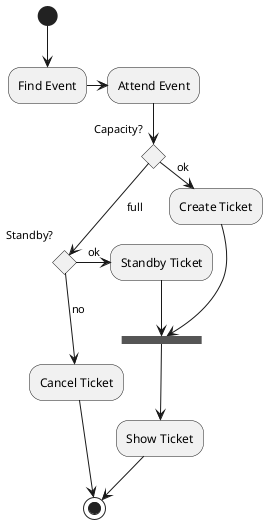
```plantuml
@startuml

' "これで、アクティビティを表現"'
' (*) -->  これが開始状態'
(*) --> "Find Event"
"Find Event" -> "Attend Event"

if "Capacity?" then
  ->[ok] "Create Ticket"
else
  -->[full] if "Standby?" then
    ->[ok] "Standby Ticket"
  else
    -->[no] "Cancel Ticket"
    ' --> (*) が 終了状態'
    "Cancel Ticket" --> (*)
  endif
endif

"Create Ticket" --> ==show==
"Standby Ticket" --> ==show==
==show== --> "Show Ticket"
"Show Ticket" --> (*)

@enduml
```

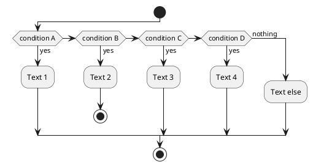
```plantuml
@startuml
start
if (condition A) then (yes)
  :Text 1;
elseif (condition B) then (yes)
  :Text 2;
  stop
elseif (condition C) then (yes)
  :Text 3;
elseif (condition D) then (yes)
  :Text 4;
else (nothing)
  :Text else;
endif
stop
@enduml
```

# 繰り返し(後判定)

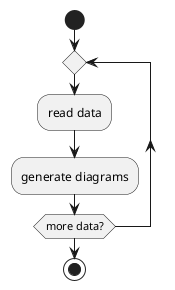
```plantuml
@startuml

start

repeat
  :read data;
  :generate diagrams;
repeat while (more data?)

stop
@enduml
```

# 繰り返し(前判定)

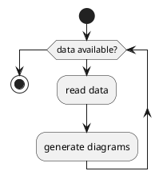
```plantuml
@startuml

start

while (data available?)
  :read data;
  :generate diagrams;
endwhile

stop

@enduml
```

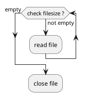
```plantuml
@startuml
while (check filesize ?) is (not empty)
  :read file;
endwhile (empty)
:close file;
@enduml
```

# 並列処理

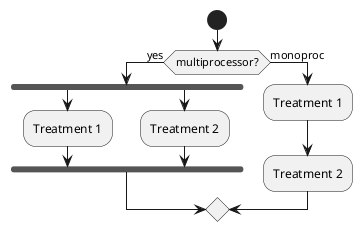
```plantuml
@startuml

start

if (multiprocessor?) then (yes)
  fork
	:Treatment 1;
  fork again
	:Treatment 2;
  end fork
else (monoproc)
  :Treatment 1;
  :Treatment 2;
endif

@enduml
```

# グループ化

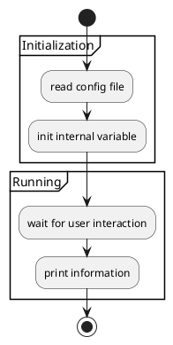
```plantuml
@startuml
start
partition Initialization {
	:read config file;
	:init internal variable;
}
partition Running {
	:wait for user interaction;
	:print information;
}

stop
@enduml
```

# 動線

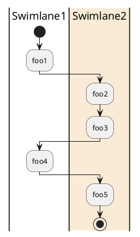
```plantuml
@startuml
|Swimlane1|
start
:foo1;
|#AntiqueWhite|Swimlane2|
:foo2;
:foo3;

|Swimlane1|
:foo4;

|Swimlane2|
:foo5;
stop
@enduml
```
# 矢印を除去

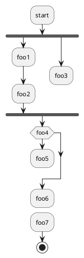
```plantuml
@startuml
 :start;
 fork
   :foo1;
   :foo2;
 fork again
   :foo3;
   detach
 endfork
 if (foo4) then
   :foo5;
   detach
 endif
 :foo6;
 detach
 :foo7;
 stop
@enduml
```

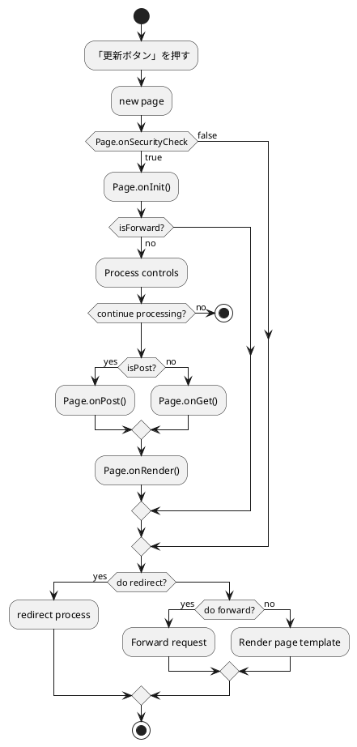
```plantuml
@startuml

start
:「更新ボタン」を押す;
:new page;
if (Page.onSecurityCheck) then (true)
  :Page.onInit();
  if (isForward?) then (no)
	:Process controls;
	if (continue processing?) then (no)
	  stop
	endif

	if (isPost?) then (yes)
	  :Page.onPost();
	else (no)
	  :Page.onGet();
	endif
	:Page.onRender();
  endif
else (false)
endif

if (do redirect?) then (yes)
  :redirect process;
else
  if (do forward?) then (yes)
	:Forward request;
  else (no)
	:Render page template;
  endif
endif

stop

@enduml
```

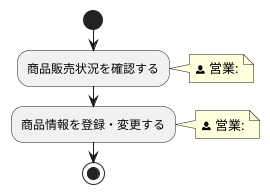
```plantuml
@startuml
start
:商品販売状況を確認する;
note right : <&person> 営業:
:商品情報を登録・変更する;
note right : <&person> 営業:
stop
@enduml

```

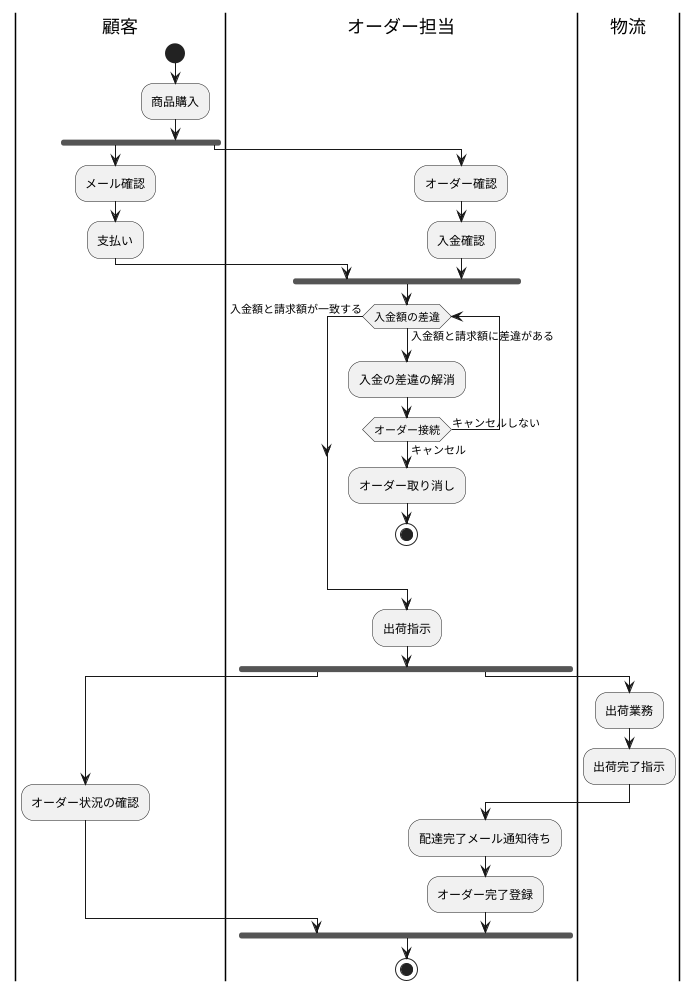
```plantuml
@startuml
|顧客|
start
:商品購入;
fork
  :メール確認;
  :支払い;
|オーダー担当|
fork again
  :オーダー確認;
  :入金確認;
endfork
while (入金額の差違) is (入金額と請求額に差違がある)
  :入金の差違の解消;
  if (オーダー接続) then (キャンセル)
    :オーダー取り消し;
    stop
  else (キャンセルしない)
  endif
endwhile (入金額と請求額が一致する)
:出荷指示;
fork
|顧客|
:オーダー状況の確認;
fork again
  |物流|
  :出荷業務;
  :出荷完了指示;
  |オーダー担当|
  :配達完了メール通知待ち;
  :オーダー完了登録;
endfork
stop
@enduml

```

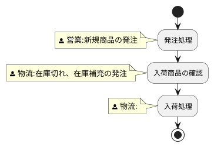
```plantuml
@startuml
start
:発注処理;
note left : <&person> 営業:新規商品の発注
:入荷商品の確認;
note left : <&person> 物流:在庫切れ、在庫補充の発注
:入荷処理;
note left : <&person> 物流:
stop
@enduml

```
