# ステートマシン図は、オブジェクトの状態を表現
* システムの振る舞いを抽象化して表現

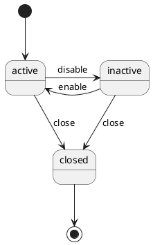
```plantuml
@startuml

' [*] --> 開始状態'
[*] --> active

active -right-> inactive : disable
inactive -left-> active  : enable

inactive --> closed  : close
active --> closed  : close

' --> [*] 終了状態'
closed --> [*]

@enduml
```

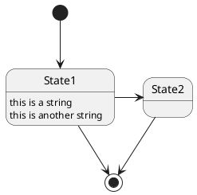
```plantuml
@startuml

[*] --> State1
State1 --> [*]
State1 : this is a string
State1 : this is another string

State1 -> State2
State2 --> [*]

@enduml
```

# 複合化

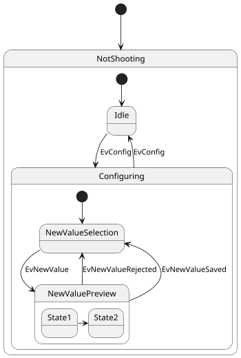
```plantuml
@startuml
scale 350 width
[*] --> NotShooting

state NotShooting {
  [*] --> Idle
  Idle --> Configuring : EvConfig
  Configuring --> Idle : EvConfig
}

state Configuring {
  [*] --> NewValueSelection
  NewValueSelection --> NewValuePreview : EvNewValue
  NewValuePreview --> NewValueSelection : EvNewValueRejected
  NewValuePreview --> NewValueSelection : EvNewValueSaved

  state NewValuePreview {
	 State1 -> State2
  }

}
@enduml
```

# フォーク

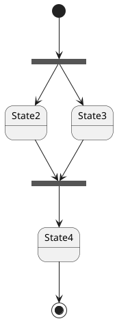
```plantuml
@startuml

state fork_state <<fork>>
[*] --> fork_state
fork_state --> State2
fork_state --> State3

state join_state <<join>>
State2 --> join_state
State3 --> join_state
join_state --> State4
State4 --> [*]

@enduml
```

# 同時状態

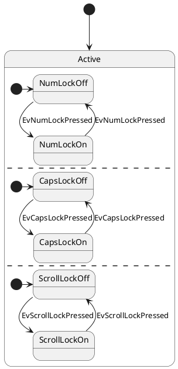
```plantuml
@startuml
[*] --> Active

state Active {
  [*] -> NumLockOff
  NumLockOff --> NumLockOn : EvNumLockPressed
  NumLockOn --> NumLockOff : EvNumLockPressed
  --
  [*] -> CapsLockOff
  CapsLockOff --> CapsLockOn : EvCapsLockPressed
  CapsLockOn --> CapsLockOff : EvCapsLockPressed
  --
  [*] -> ScrollLockOff
  ScrollLockOff --> ScrollLockOn : EvScrollLockPressed
  ScrollLockOn --> ScrollLockOff : EvScrollLockPressed
}

@enduml
```

# 注釈

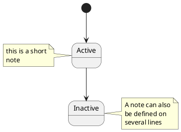
```plantuml
@startuml

[*] --> Active
Active --> Inactive

note left of Active : this is a short\nnote

note right of Inactive
  A note can also
  be defined on
  several lines
end note

@enduml
```

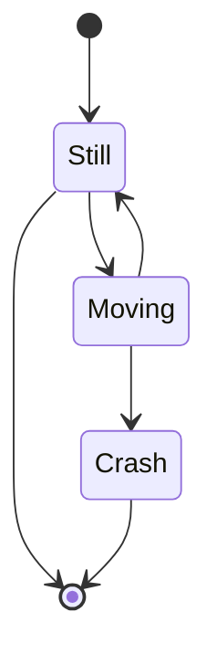
```mermaid
stateDiagram
    [*] --> Still
    Still --> [*]

    Still --> Moving
    Moving --> Still
    Moving --> Crash
    Crash --> [*]
```

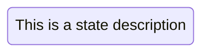
```mermaid
stateDiagram
    s2 : This is a state description
```

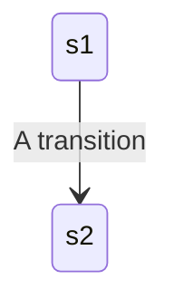
```mermaid
stateDiagram
    s1 --> s2: A transition
```

# Composite states
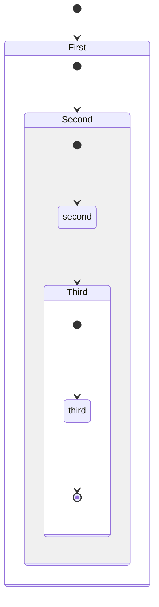
```mermaid
stateDiagram
    [*] --> First

    state First {
        [*] --> Second

        state Second {
            [*] --> second
            second --> Third

            state Third {
                [*] --> third
                third --> [*]
            }
        }
    }
```

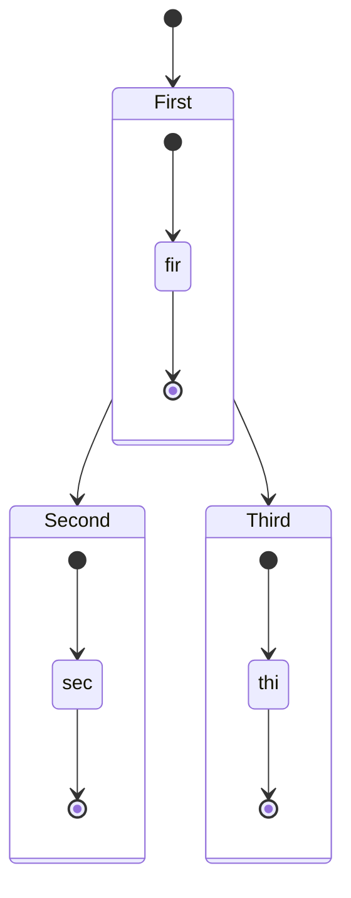
```mermaid
stateDiagram
    [*] --> First
    First --> Second
    First --> Third

    state First {
        [*] --> fir
        fir --> [*]
    }
    state Second {
        [*] --> sec
        sec --> [*]
    }
    state Third {
        [*] --> thi
        thi --> [*]
    }
```

# 状態をフォーク
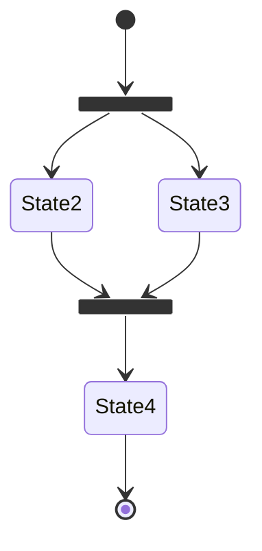
```mermaid
stateDiagram
 state fork_state <<fork>>
   [*] --> fork_state
   fork_state --> State2
   fork_state --> State3

   state join_state <<join>>
   State2 --> join_state
   State3 --> join_state
   join_state --> State4
   State4 --> [*]
```

# ノートを追加

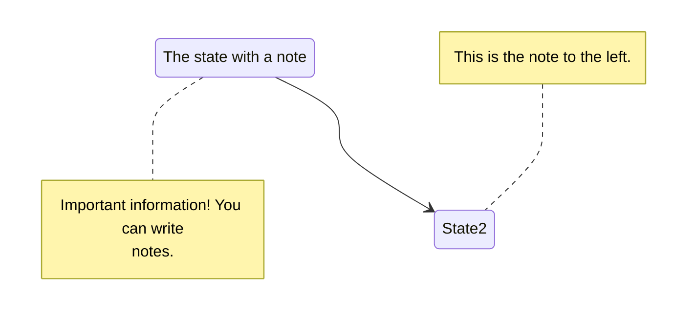
```mermaid
stateDiagram
    State1: The state with a note
    note right of State1
        Important information! You can write
        notes.
    end note
    State1 --> State2
    note left of State2 : This is the note to the left.
```

# Concurrency

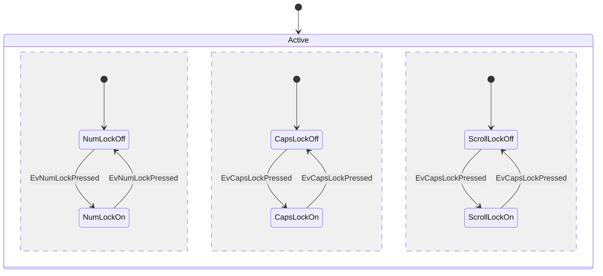
```mermaid
stateDiagram
    [*] --> Active

    state Active {
        [*] --> NumLockOff
        NumLockOff --> NumLockOn : EvNumLockPressed
        NumLockOn --> NumLockOff : EvNumLockPressed
        --
        [*] --> CapsLockOff
        CapsLockOff --> CapsLockOn : EvCapsLockPressed
        CapsLockOn --> CapsLockOff : EvCapsLockPressed
        --
        [*] --> ScrollLockOff
        ScrollLockOff --> ScrollLockOn : EvCapsLockPressed
        ScrollLockOn --> ScrollLockOff : EvCapsLockPressed
    }
```
