# Sequence diagrams

* オブジェクト同士がどのように相互作用するか、それが発生する順番はどうか、を表現する

* 特定のシナリオにおける相互作用であること、が重要

* プロセスは縦方向で表現される
* 相互作用は矢印で表現される

## ビジネスレベルで使える

* 開発者だけのものではない。
* 異なるビジネスOBJ 同士が相互作用するかを表現できる
* ビジネスレベルの シーケンス図は、将来のシステムの実装を見せることで、要件ドキュメントとして使うこともできる

* あるプロジェクトで、アナリストがユースケース図を次のレベルに進める際の要件定義期間に使うことができる。
* ユースケース図が洗練されていくことで、シーケンス図が出来上がったりする

## 開発者はこう使う
* 将来のシステムの振る舞いをドキュメント化するために使う
* 開発者と設計者が、システムのオブジェクト間の相互作用を表現するために、システム設計に肉付けをするために使う
* 新しいシステムの設計のためだけではなく、既存のシステムがどう相互作用するかをドキュメント化するのにも使用できる
* 既存システムのシーケンス図の作成は、あるシステムを他の組織や人物に渡す際に非常に有用

* メッセージそれ自体よりも、メッセージがいつ発生するのかに焦点を当てる

## 1. Lifelines
* ライフライン表記はダイアグラムの上部に記載される
* ライフラインとは、モデル化対象であるシーケンスに参加しているロールまたはオブジェクトを表したもの
* ライフラインは、シーケンス図におけるあるクラスの特定のインスタンスを表す

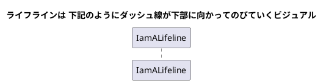

## 2. Messages
* 同期メッセージは実線で
* 非同期メッセージは 点線で表現
* メッセージ/メソッド 名は線の上に記載
* オブジェクトに渡されるメッセージは受けてのOBJのクラスが実装する操作/メソッドを表す

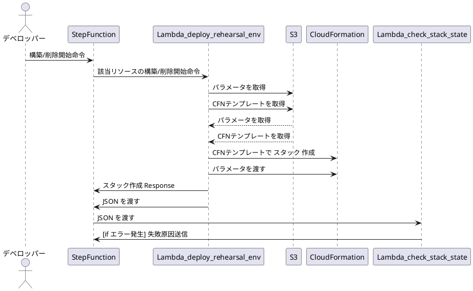

## 3. Guards
* OBJの相互作用をモデル化する際の、条件分岐の表現には Guards が使われる。
* Guards はUML 図のフローをコントロールするために使われる。
* Guards は単一のメッセージにのみ適用される
* Guards はメッセージラインの上、メッセージ名の前に記載する

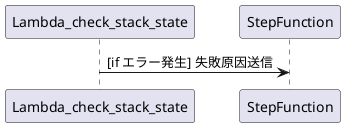

## アクター
* シーケンス図が、あるユースケースの一部であるときに、アクターが登場する
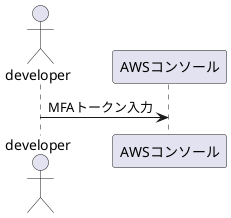

## エンティティ
* エンティティのライフラインは、システム内の情報を意味し属性および振る舞いを保持する。一般にデータベース等を利用して永続化されることが多い
* 例) カスタマーサービスアプリの場合、カスタマーエンティティは、カスタマーに関連するすべてのデータをマネージする

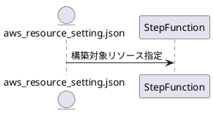

## バウンダリ
* バウンダリは、システムとアクタの境界で作用するクラス。具体的には、画面や外部システムアクセスを担当
* 例) UI、DBのゲートウェイ、ユーザーが利用するメニュー

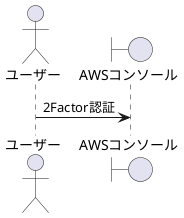

## コントロール
* コントロール 要素は、エンティティをコントロールしたり、管理したりする
* バウンダリとエンティティ間の相互作用をオーガナイズしたり、スケジュールしたりする仲介者として機能する

## Activation Bars
* ライフライン上に配置されるボックス
* 2つのオブジェクト間の相互作用の間、オブジェクトがアクティブである(またはインスタンス化される)ことを表す
* アクティベーションバーの長さは、OBJ がアクティブである期間を表す
* アクティベーションバーによって、メッセージの交換中は、メッセージのコーラーとレシーバーとが双方ともにアクティブ/インスタンス化されている ことを表す

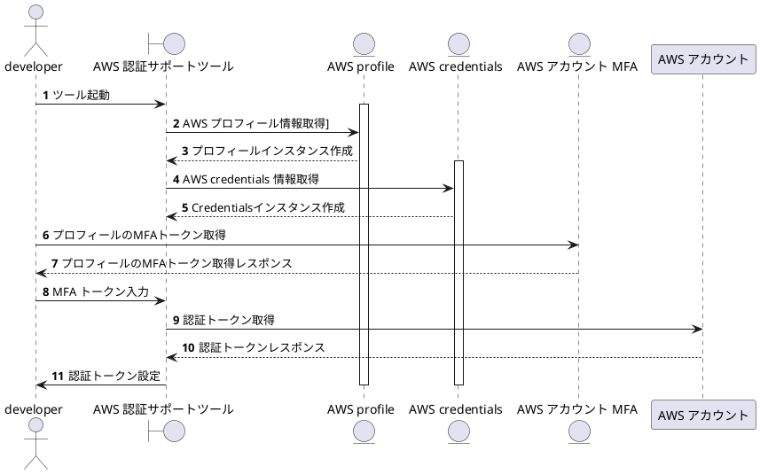

## Synchronous message
* 同期メッセージは、メッセージの送り手が、次のメッセージを送る前に、受け手によるメッセージの処理と返信を待つことを表す
* 同期メッセージのアローヘッドは solid

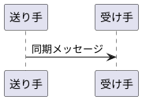

## Asynchronous message
* 非同期メッセージは、メッセージの送り手が、次のメッセージを送る際に、受け手によるメッセージの処理と返信を待たないことを表す
* 非同期メッセージのアローヘッドは line

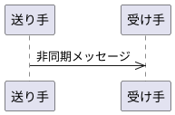

## Return message
* メッセージの応答は、メッセージレシーバーがメッセージの処理を終了し、コントロールをメッセージコーラーに返すことを表す
* 返答メッセージはオプショナルな記号。同期メッセージによって始まったアクティベーションバーの終わりは、リターンメッセージを表す
* Tips：リターンメッセージを最小限にすることで、ダイアログが散漫になるのを回避することができる。
* なぜなら、コーラーの最初のメッセージアロー自身が返り値を表すことができるから

## Participant  creation message
* オブジェクトはイベントの間中存在している必要はない
* オブジェクト/participants は送られたメッセージに従って作成されることもできる
* 作成された OBJ が直後に何かをする場合、アクティベーションボックスを OBJのボックス直下に記載すべし

## Participant destruction message
* 不要となった participants をシーケンス図から削除することもできる。
* 削除される participants はライフライン上の X で表現される

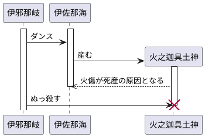

## Reflexive message
* OBJ が自身にメッセージを送るとき、reflexive メッセージと呼ばれる

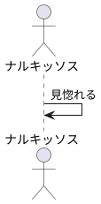

### 複雑な相互作用は、シークエンスフラグメンツで管理すべし
* シークエンス フラグメントは、オブジェクト間の相互作用のセクションをフレームしたボックスで表現される
* シークエンス フラグメントは、複雑な相互作用(オルタナティブフローやループ) を、より構造化した形で表現するのに使われる
* オペレーター： フラグメントの左上にあり、どういう種類のフラグメントなのかを示す 

### Alternatives
* The alternative combination fragment は、if then else ロジックを表現する。
* alt フラグメント内で、選択肢は interaction operands と呼ばれる --- によって分けられる。
* 各オペランドには Guard がある。

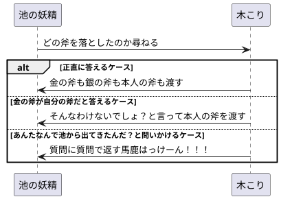

# Options
* ある条件下でのみ発生するシーケンスであることを示唆する
* if then ロジックを表現する
* alt とは異なり、フラグメントはオペランドで分けられたりしない。
* Option のガードは一つだけ

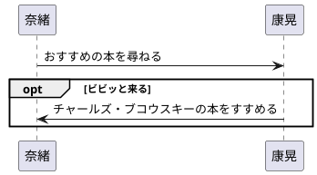

# Loops

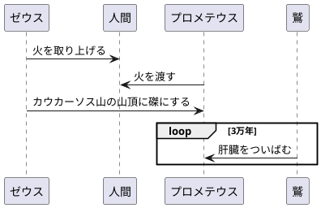

# Reference Fragment
* シーケンス図の一部を再利用するのに使える
* ダイアグラムの一部を、別のダイアグラムから ref フラグメントを使って参照できる
* 参照される シーケンスダイアグラムの名前はフレーム内に記載する

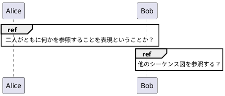

