# シーケンス図は、オブジェクト間のやり取りするメッセージと順序を表現
* 2つの分類子間のメッセージを描画するために使います。 分類子を、明示的に宣言する必要はありません。

* ` -> 同期メッセージ`
* ` <- 同期応答`
* `->> 非同期メッセージ
`
* ` <<-- 非同期応答`
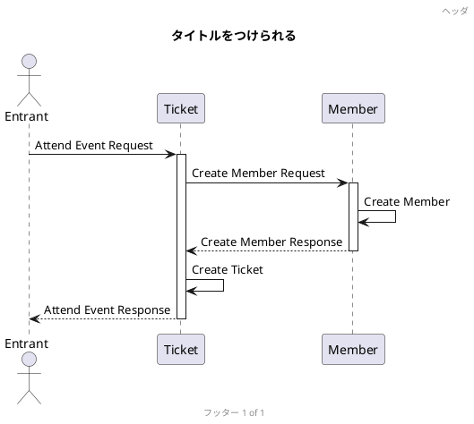

# 分類子
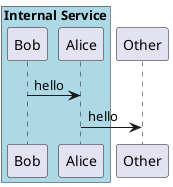

# メッセージのグループ化

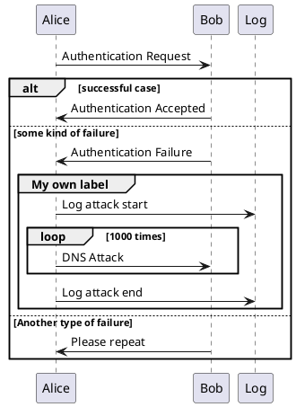
# 図を論理的なステップにわける
* 間隔の調整もしている
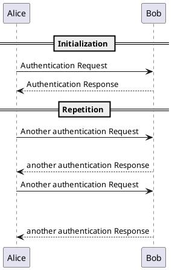

# 遅延を表現

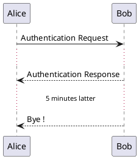

# ライフラインの活性化と破壊
* activate と deactivate を使って分類子の活性化を表します。

* 分類子の活性化はライフラインで表されます。

* activate と deactivate は直前のメッセージに適用されます。

* destroy は分類子のライフラインが終わったことを表します。
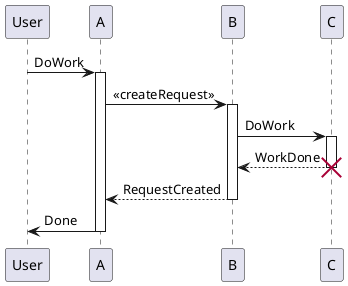

# ライフラインを入れ子にする
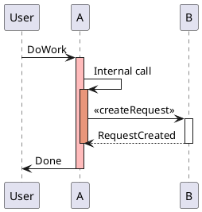

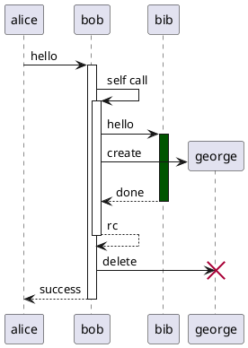

# mermaid バージョン

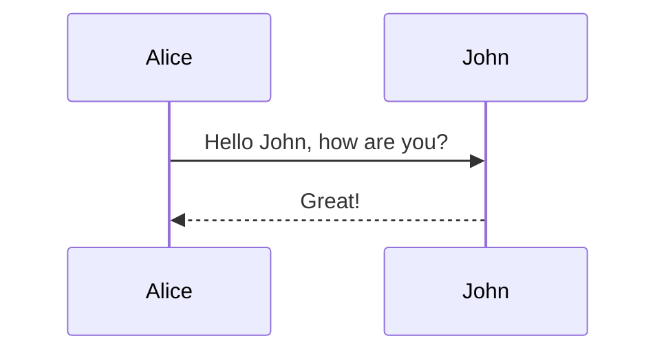

# mermaid バージョン

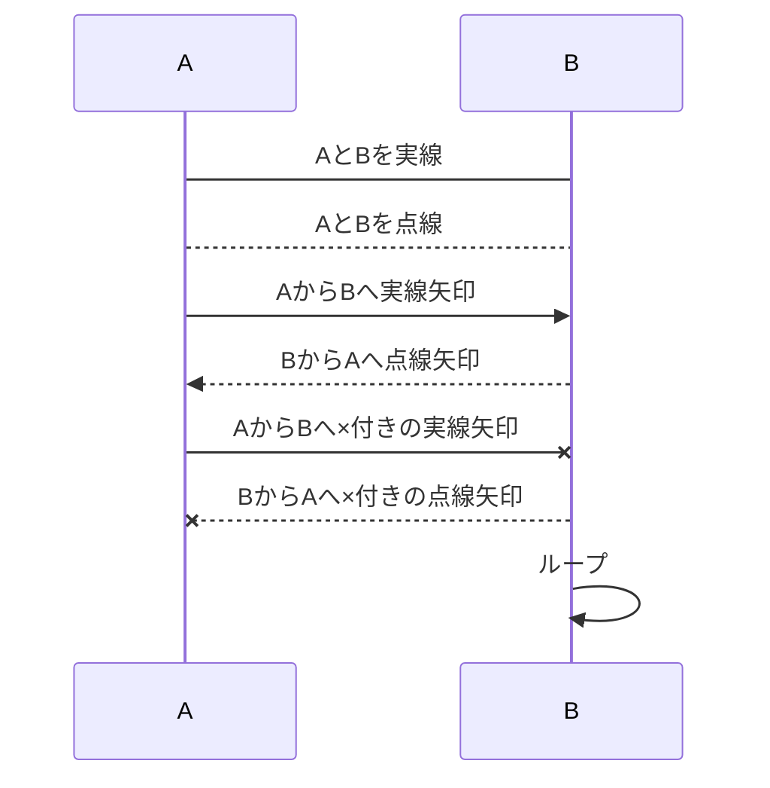

* +をつけると実行仕様の最初
* -をつけると実行仕様の終わり

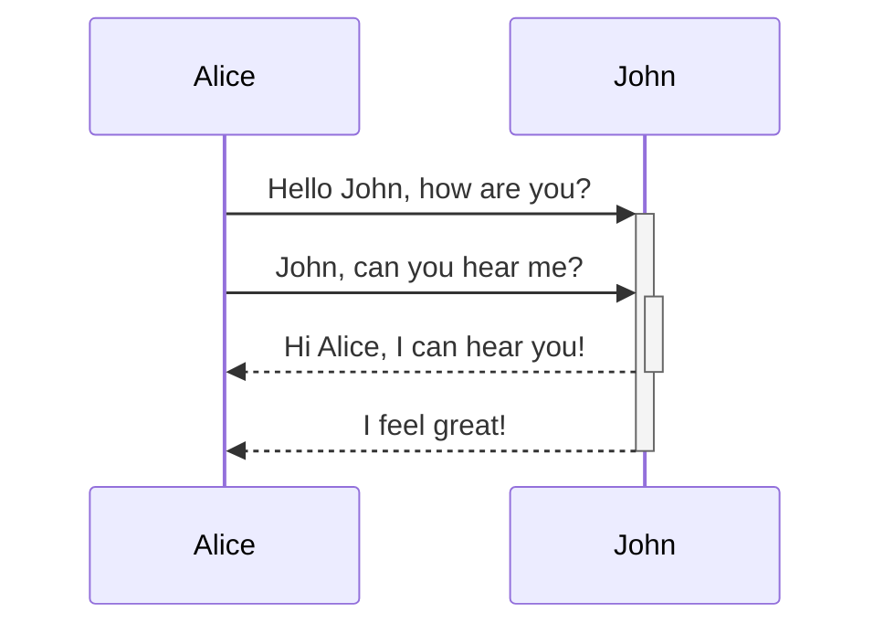

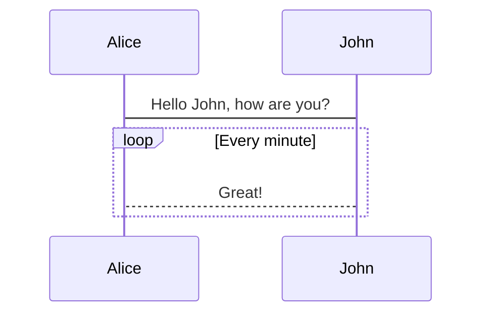

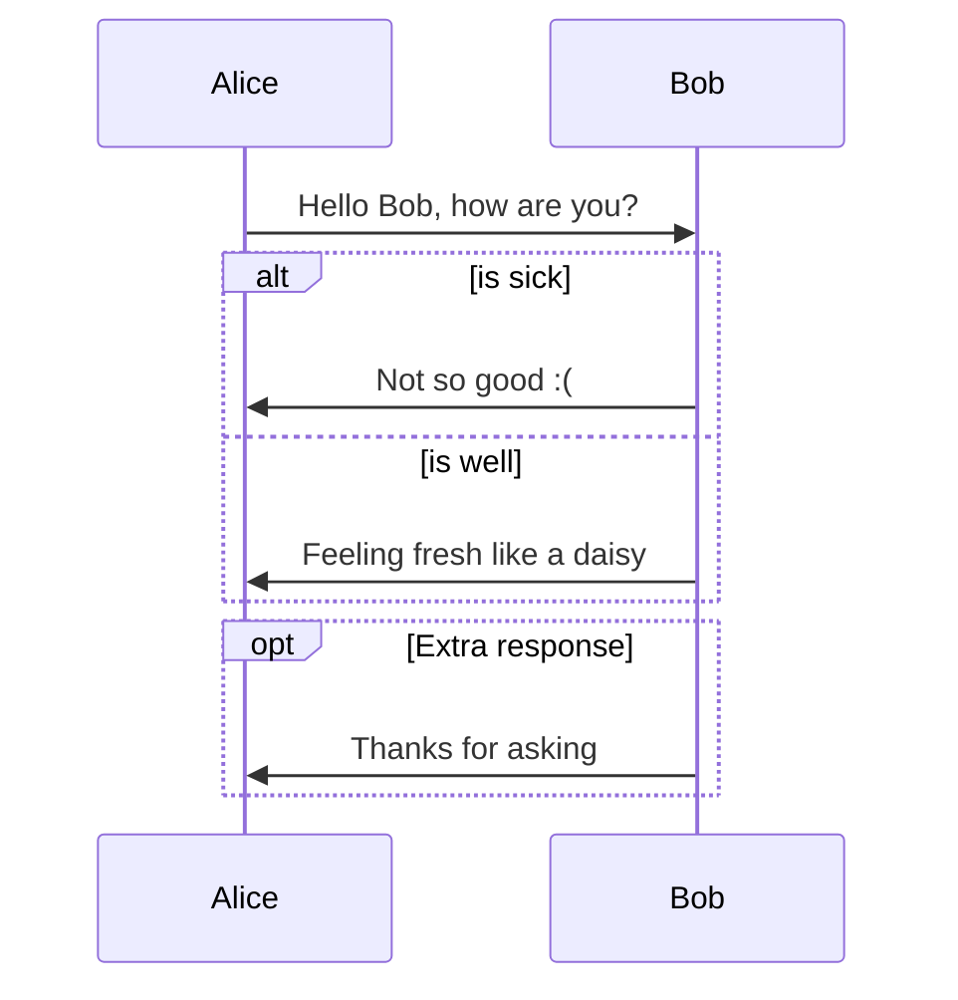
