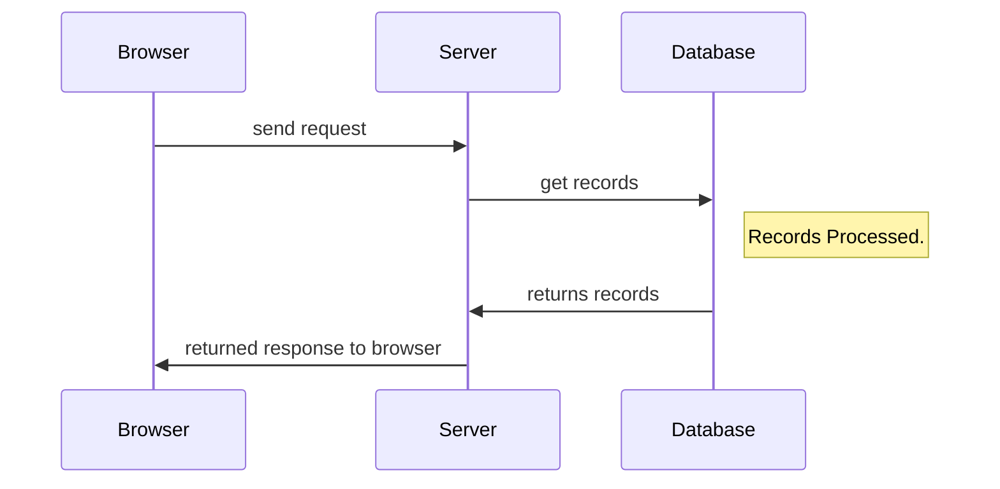
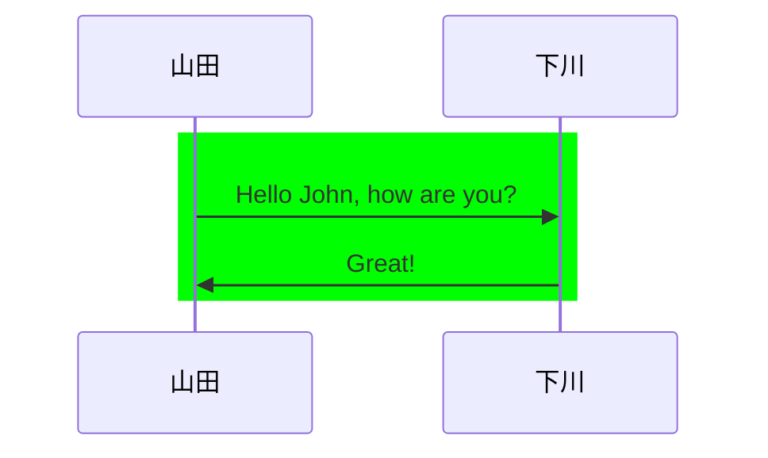
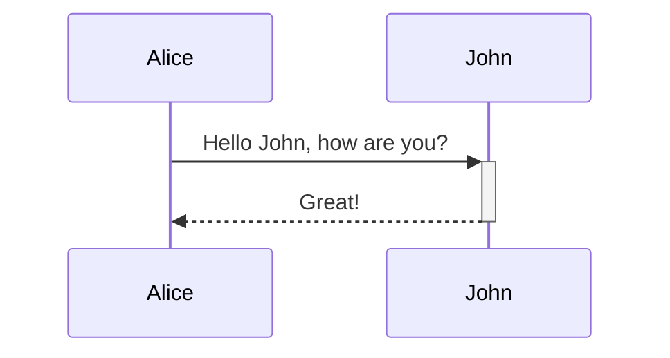
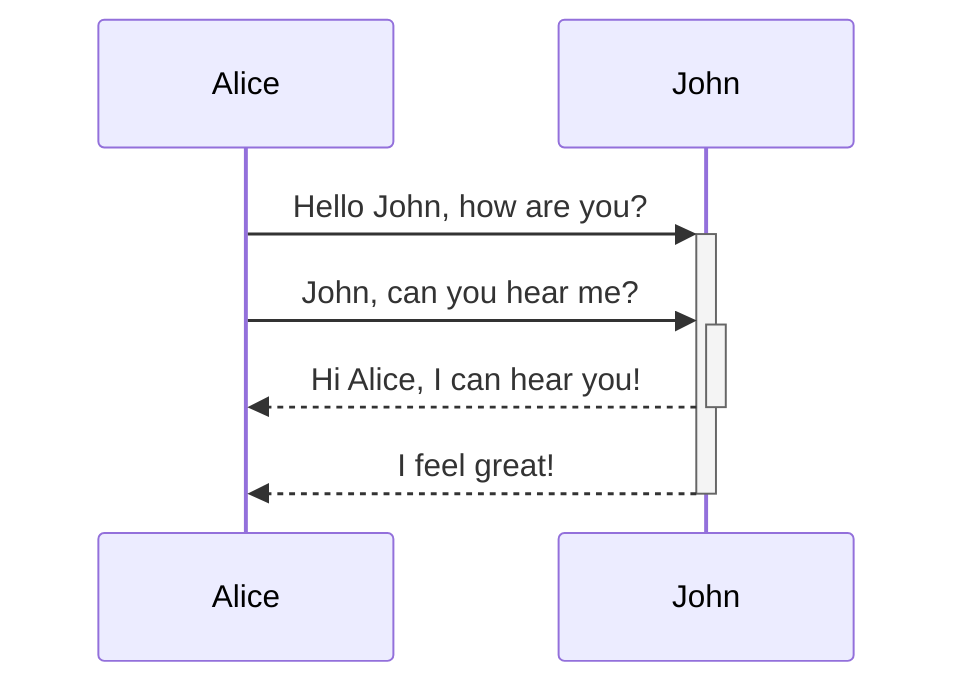
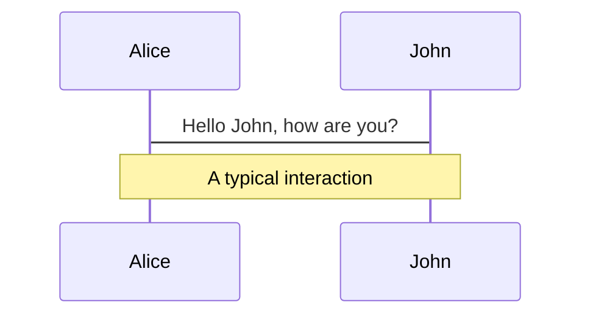
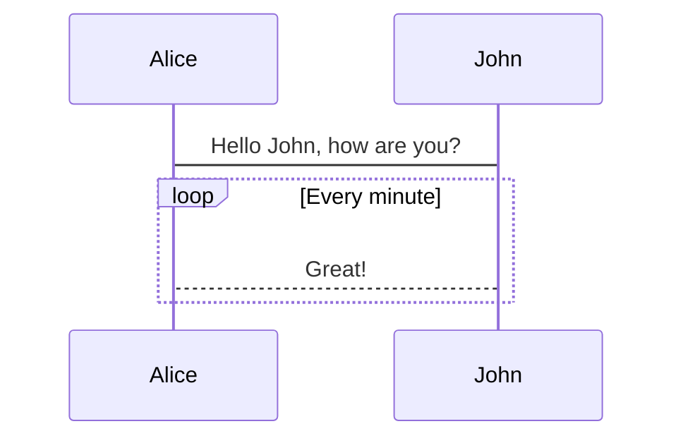
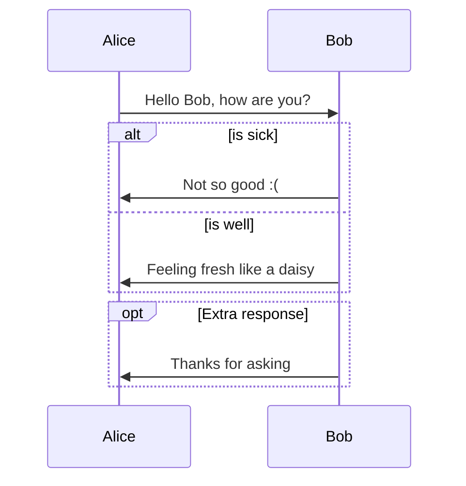

```mermaid
sequenceDiagram

Browser->> Server: send request

Server->> Database: get records

Note right of Database: Records Processed.

Database->> Server: returns records

Server->> Browser: returned response to browser
```
 
 
 
 

```mermaid
sequenceDiagram
%% 色をつけられる
rect rgb(0, 255, 0)
    participant A as 山田
    participant J as 下川
    A->>J: Hello John, how are you?
    J->>A: Great!
end
```

# Activate or deactivate actors

```mermaid
sequenceDiagram
    Alice->>+John: Hello John, how are you?
    John-->>-Alice: Great!
```

# Activations をスタック

```mermaid
sequenceDiagram
    Alice->>+John: Hello John, how are you?
    Alice->>+John: John, can you hear me?
    John-->>-Alice: Hi Alice, I can hear you!
    John-->>-Alice: I feel great!
```

# Actor 間をまたいだノート

```mermaid
sequenceDiagram
    Alice->John: Hello John, how are you?
    Note over Alice,John: A typical interaction
```

# ループを表現

```mermaid
sequenceDiagram
    Alice->John: Hello John, how are you?
    loop Every minute
        John-->Alice: Great!
    end
```

# alternative パスまたはオプションパスを表現

```mermaid
sequenceDiagram
    Alice->>Bob: Hello Bob, how are you?
    alt is sick
        Bob->>Alice: Not so good :(
    else is well
        Bob->>Alice: Feeling fresh like a daisy
    end
    opt Extra response
        Bob->>Alice: Thanks for asking
    end
```
