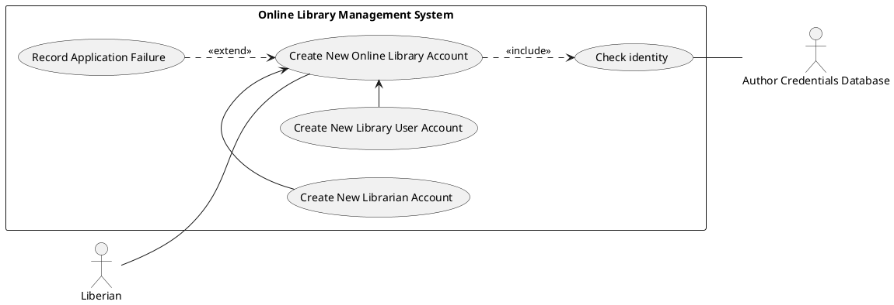
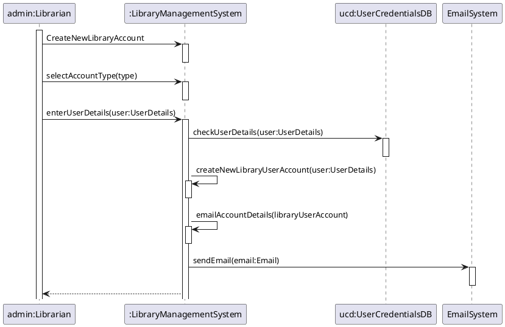
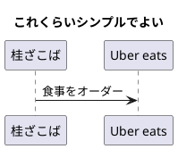

# シークエンス図を書くコツ

## ユースケースのエッセンスを掴んだ小さなシーケンス図を書きましょう
* オブジェクトやメッセージがたくさんのシーケンス図で読み手を混乱させないように
* 少し小さめくらいのシーケンス図で、あなたのシステムが何をしているのかを説明しましょう
* ダイアグラムが1ページに収まるようにしましょう
* 説明を書き加えることができるくらいのスペースを空けましょう
* シーケンス図を複数書くよりも、シナリオ間で共通するものを見つけ出し、それに注力しましょう
* コードに表現力があり、それ自体でわかりやすいようであれば、シーケンス図を最初に書く、ということをする必要はありません

## シーケンス図とは、単一のユースケースに焦点を当てたもの
* シーケンス図は、単一のユースケースのイベント群のフローやシナリオを表現する
* シーケンス図のメッセージフローは、特定のユースケースの物語に基づく

## シーケンス図を書いたり、どんな相互作用を記述するかを判断する前に
* まず、ユースケース図を書く必要がある
* 特定のユースケースについての、包括的な描写を準備しておく必要がある

## 土台となるユースケース

* 上記ユースケースの、「Create New Online Library Account」の「Create New User Account」と名付けたユースケースに焦点を当てる

### シーケンス図を書く前にすること

####  該当ユースケースに登場するオブジェクトやアクターを identify する
* 例えば Librarian、Online Library Management system、User credentials database、Email system

#### ユースケースが行うことを描写する
* この description から相互作用を抽出する。これがシーケンス図になる
* 相互作用は、ユースケースが実行されたときにオブジェクト間で発生する

* 下記のような相互作用が導き出されたとする
* 司書がシステムに、新しいオンライン図書館アカウント作成をリクエストする
* 司書は図書館ユーザータイプを選択する
* 司書はユーザーの詳細を入力する
* ユーザーの詳細は、ユーザー認証DBでチェックされる
* 新シい図書館ユーザーアカウントが作成される
* 新しいアカウントの詳細のサマリーがメールでユーザーに送られる

* 相互作用がクリアになったら、シーケンス図を書き始める

## シーケンス図 のよくある間違い
* 詳細を書き込みすぎる
* 結果、散漫で読みづらくなる
* 古くなったシーケンス図。実際のインターフェイスやアーキテクチャと比較する意味がない。
* 古くなったら修正しましょう。
* ユースケースのテキストとメッセージアローの間にスペースがないシーケンス図。
* 結果、読みづらい
* メッセージアローの送信元を考慮していないシーケンス図。

## 1. 不要な詳細は除去しましょう
* コードにいくつかの分岐があったとしても、ブロックやシナリオ要素を使って全てを同じダイアグラムに含める必要はない。
* 複雑になると、読みづらく、包括的に見ることが難しくなる

## 2. メッセージの多くは左から右に向かうべき
* シーケンス図では、メッセージは左上の角から始まるべき
* ペアとなるオブジェクト同士が、互いのオペレーションを開始したときなどは、例外にあたる

## 3. 古くなったシーケンス図は更新しましょう
* 現実のインターフェイス、アーキテクチャ、振る舞いなどを反映していないシーケンス図はドキュメントとしての価値がない
* 上記は、ハイレベルなシーケンス図がロウレベルなダイアグラムよりも機能しやすい理由でもある。
* アプリの詳細が変わっても、適切であり続けられる可能性が高い。または、修正が少なくてすむ

## 4. シンプルなロジックを扱う場合は、シーケンス図は避ける
* よくある間違い。貴重な時間を多くのシーケンス図の作成に浪費してしまうこと
* あらゆるユースケース、あらゆるシナリオをシーケンス図作成に浪費する
* シーケンス図は、**複雑なロジックを扱う場合に限り** 作るべき
* シンプルなロジックにシーケンス図を作っても、**付加価値は殆どない**

## 5. ユースケースのテキストメッセージアローとの間には、a visual trace をつける
* ユースケースの各センテンスの周りには空白を置くべき
* 視覚的にわかるように、各センテンスと視覚的な記号とが調和しているべき

## 6. Keep your sequence diagrams abstract without the need for plumbing
* ダイアグラムは preliminary な設計の視点を反映したもの
* 実際の設計の詳細な点をハイライトするもの
* シーケンス図は、コーディングを始める前に行う最後のデザイン部分となる

## 7.  Consider behavior allocation, seriously
* どのクラスに、どのような振る舞いを割り当てるか、という意思決定はとても重要
* その意思決定に、シーケンス図が活躍する

## 8. Include the use case text on the sequence diagram
* ユースケースのテキストを、シーケンス図の余白に書いておくと、設計時に要件を確認しやすい
* シーケンス図は、紐づいているユースケースの物語のフローにマッチすべき

## 9. Follow the basics when it comes to allocating behavior by using message arrows
* オブジェクトは、理想的には単一のパーソナリティのみを持つべき
* つまり、クラスは、関連性の強い一連の振る舞いにフォーカスすべき
* 別の言い方をすると、
* state objects はまとまりがあり疎結合である必要がある
* もう一つ意識しておきたいこととして、再利用性をもたせられるかどうか、考慮したほうがよいということ
* そのオブジェクトは、別のプロジェクトで使用できるかもしれない
* また、メソッドというものはオブジェクトに割り当てられるものであり、
* メソッドとオブジェクトとの間に、a decent fit があるかどうか、問いかける習慣をつけるべき

