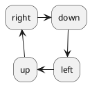
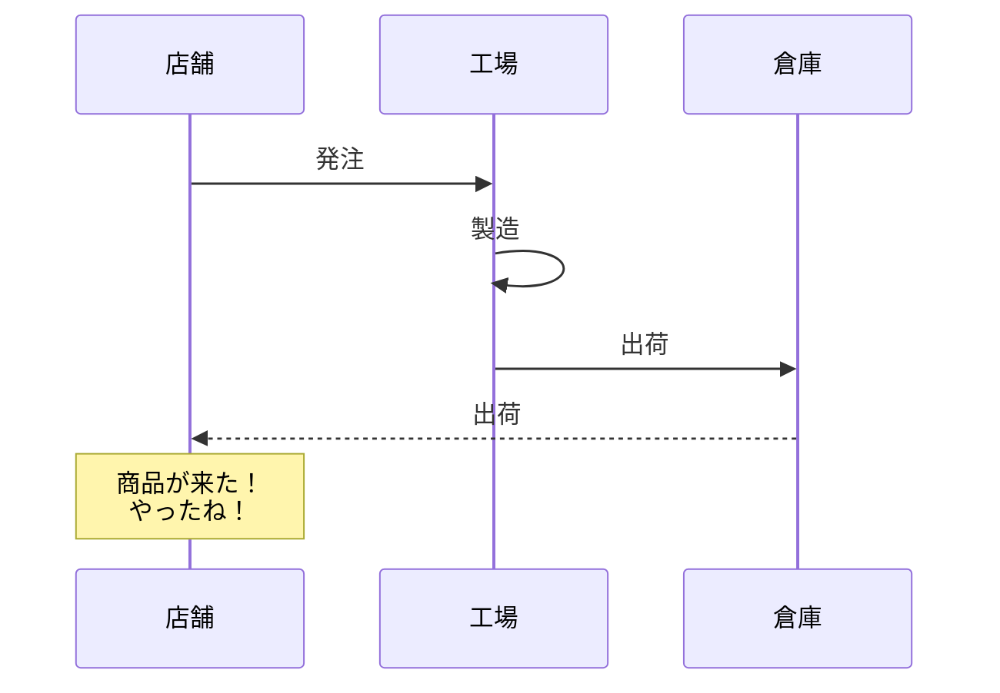

```plantuml
@startuml

up -up-> right
-right-> down
-down-> left
-left-> up

@enduml
```

# 業務フロー図
## 発注フロー

```mermaid
sequenceDiagram
participant A as 店舗
participant B as 工場
participant C as 倉庫
A->>B: 発注
B->>B: 製造
B->>C: 出荷
C-->>A: 出荷
Note over A: 商品が来た！<br>やったね！
```
