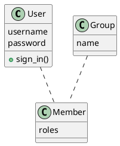
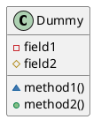
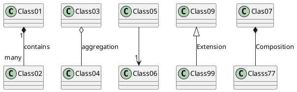
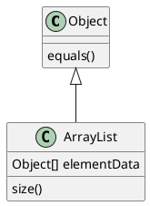
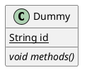
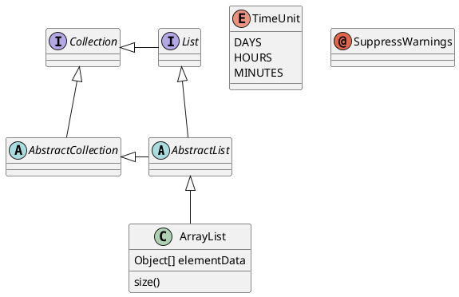
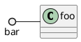
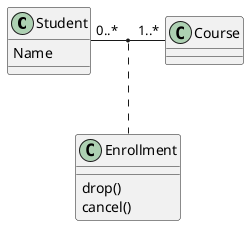

# クラス図は、論理的なビューを表現
* OOP を扱う際の the main building block
 
* 下記を表現
* システムの中のクラス
* attribute
* 各クラスの操作
* クラス間の関係
 
* トップに名前、真ん中に attribute、ボトムに操作やメソッドが配置されることが多い
 
* 関連クラスが多い場合、クラスがグループ化されて表現される
 
* 参考クラス図
https://creately.com/diagram-community/examples/t/class-diagram

* 表記方法
* `+ public`
* `- private`
* `# protected`
* `~ package`

# Extension Aggregation Composition
* 1 to many なども表現

# メソッドの追加

# Abstract と Static

# ロリポップインターフェイス

# 関連クラス

