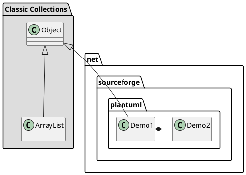
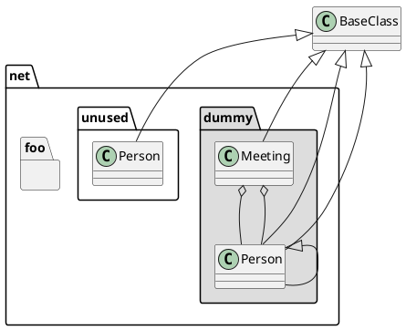

# パッケージ図

* システム内の異なるパッケージの依存関係を表現する

```plantuml
@startuml

package "Classic Collections" #DDDDDD {
  Object <|-- ArrayList
}

package net.sourceforge.plantuml {
  Object <|-- Demo1
  Demo1 *- Demo2
}

@enduml
```

## 名前空間を表現

```plantuml
@startuml

class BaseClass

namespace net.dummy #DDDDDD {
	.BaseClass <|-- Person
	Meeting o-- Person

	.BaseClass <|- Meeting
}

namespace net.foo {
  net.dummy.Person  <|- Person
  .BaseClass <|-- Person

  net.dummy.Meeting o-- Person
}

BaseClass <|-- net.unused.Person

@enduml
```
