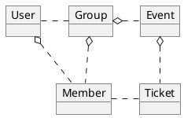
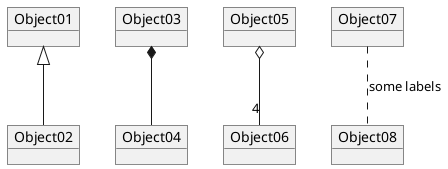
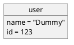
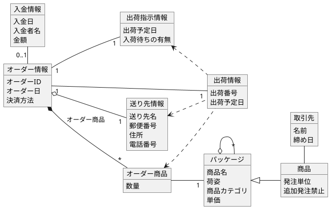
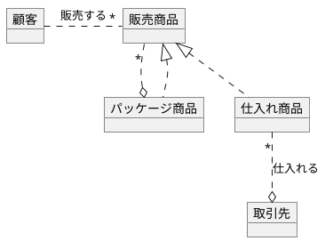

# オブジェクト図は、論理的なビューを表現
* インスタンスダイアグラムとも呼ばれる
* クラス図と似ている
* クラス図と異なり、use real-world examples
* ある時点でのシステムが、どのようであるか、を表現する
</br>
* 参照
https://creately.com/diagram-community/popular/t/object-diagram


* `object オブジェクト`
* `*- コンポジション`
* `o- 集約`





# フィールドを表現







```plantuml

```

```plantuml

```

```plantuml

```

```plantuml

```
