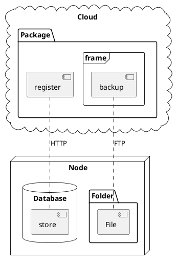
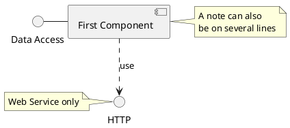
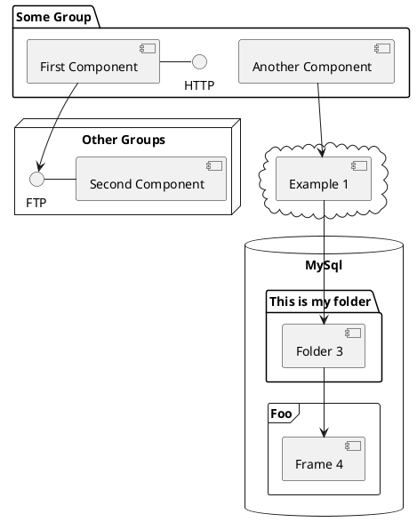

# コンポーネント図は、コンポーネントの依存関係を表現
* コンポーネントが多い、複雑なシステムを表現する際に使われる
* コンポーネントは、インターフェイスを通じてコミュニケートする
* インターフェイス間はコネクターを使って接続される
 

* 参考
https://creately.com/diagram-community/examples/t/component-diagram

* `[] コンポーネント`

# インターフェイスとコンポーネント

# コンポーネントのグループ化

