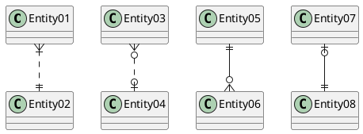
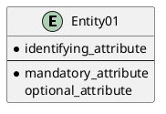
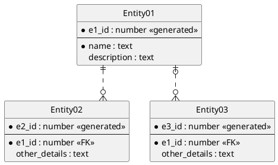

Type	記号
0か1	|o--
1のみ	||--
0以上	}o--
1以上	}|--

```plantuml
@startuml

Entity01 }|..|| Entity02
Entity03 }o..o| Entity04
Entity05 ||--o{ Entity06
Entity07 |o--|| Entity08

@enduml
```

# エンティティ

```plantuml
@startuml
entity Entity01 {
  * identifying_attribute
  --
  * mandatory_attribute
  optional_attribute
}
@enduml
```

# 複雑な例

```plantuml
@startuml

' hide the spot
hide circle

' avoid problems with angled crows feet
skinparam linetype ortho

entity "Entity01" as e01 {
  *e1_id : number <<generated>>
  --
  *name : text
  description : text
}

entity "Entity02" as e02 {
  *e2_id : number <<generated>>
  --
  *e1_id : number <<FK>>
  other_details : text
}

entity "Entity03" as e03 {
  *e3_id : number <<generated>>
  --
  *e1_id : number <<FK>>
  other_details : text
}

e01 ||..o{ e02
e01 |o..o{ e03

@enduml
```
