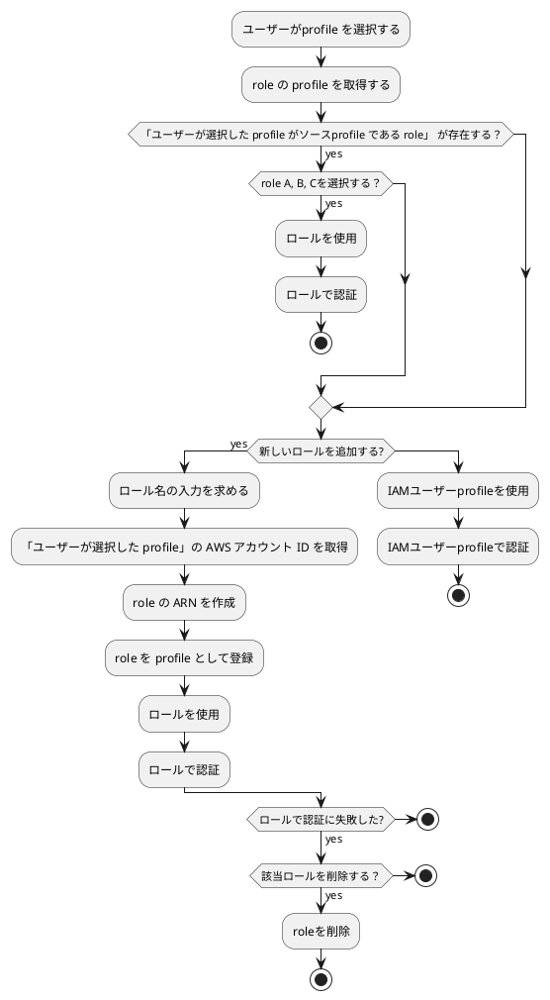
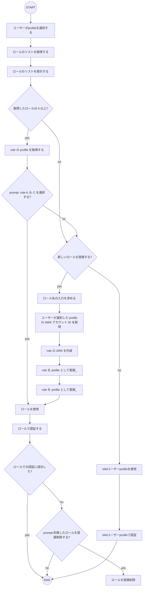

# PlantUMLがフローチャートに向いていない(Mermaid の方がよい)理由

1. 分岐を直感的に書くことができない
2. 複雑な分岐が書けない

```plantuml
@startuml


:ユーザーがprofile を選択する;
:role の profile を取得する;

'ifA
if (「ユーザーが選択した profile がソースprofile である role」 が存在する？) then (yes)
'ifB
if (role A, B, Cを選択する？) then (yes)
	:ロールを使用;
	:ロールで認証;
	stop
else
'ifA end
endif
'ifB enc
endif

'ifC
if (新しいロールを追加する?) then (yes)
:ロール名の入力を求める;
:「ユーザーが選択した profile」の AWS アカウント ID を取得;
:role の ARN を作成;
:role を profile として登録;
:ロールを使用;
:ロールで認証;
else
:IAMユーザーprofileを使用;
:IAMユーザーprofileで認証;
stop
' ifC end
endif
'ifD
if (ロールで認証に失敗した?) then (yes)
else
stop
endif
if (該当ロールを削除する？) then (yes)
:roleを削除;
else
stop
endif
stop
@enduml
```

## ロールを選択する部分

```mermaid
graph TB

Start((START)) -->

B[ユーザーがprofileを選択する]
 -->
 GetRollList[ロールのリストを取得する]
-->
PromptRollList[ロールのリストを表示する]
-->
IfRollListIsNotZero{取得したロールは 0 以上?}
-- no --> ifB
IfRollListIsNotZero -- yes -->
C[role の profile を取得する]
-->
%% 分岐1
ifA{prompt: role A, B, C を選択する?}
%% 分岐1-1
ifA -- yes --> resA[ロールを使用]
resA --> D[ロールで認証する]
%% 分岐
D --> ifC{ロールでの認証に成功した?}
ifC -- yes -->L
%% 分岐
ifC -- no --> ifD{prompt:失敗したロールを登録削除する?}
ifD -- yes --> M[ロールを登録削除]
ifD -- no --> L
%% 分岐1-2 --> 分岐2
ifA -- no --> ifB{新しいロールを登録する?}


%% 分岐2-1
ifB -- yes --> E[ロール名の入力を求める]
--> F[ユーザーが選択した profileの AWS アカウント ID を取得]
--> G[role の ARN を作成]
--> H[role を profile として登録_]
--> I[role を profile として登録_]
--> resA

%% 分岐2-2
ifB -- no --> J[IAMユーザーprofileを使用]
--> K[IAMユーザーprofileで認証]
--> L((END))
```

