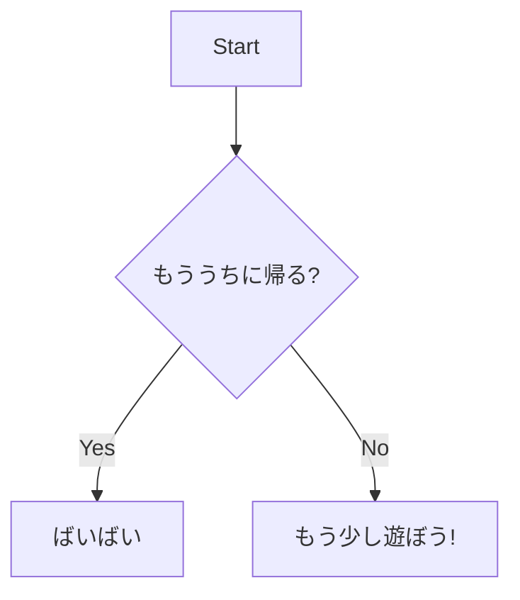
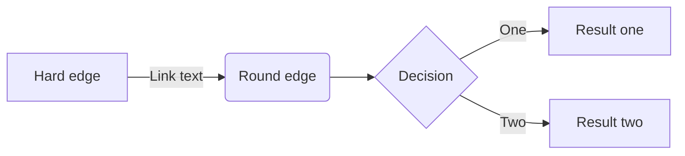
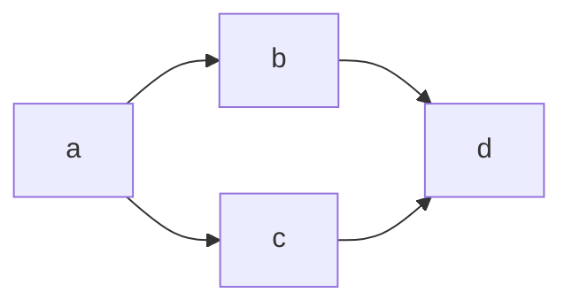
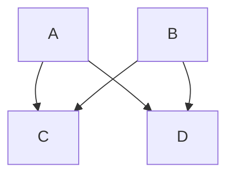

# 縦

```mermaid
graph TD
A[Start] --> C{もううちに帰る?}
C -->|Yes| D[ばいばい]
C -->|No| E[もう少し遊ぼう!]
```
# 横

```mermaid
graph LR
    A[Hard edge] -->|Link text| B(Round edge)
    B --> C{Decision}
    C -->|One| D[Result one]
    C -->|Two| E[Result two]
```

# 分かれ道くねくね

```mermaid
graph LR
   a --> b & c--> d
```

```mermaid
graph TB
    A & B--> C & D
```

```mermaid
graph TB
    A --> C
    A --> D
    B --> C
    B --> D
```
