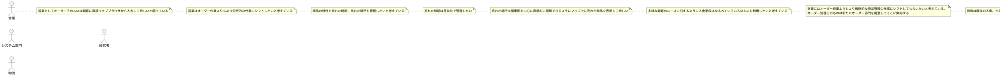

```plantuml
@startuml
left to right direction

actor システム部門
actor 物流
actor 経営者
actor 営業

actor 営業
note right : 営業としてオーダーそのものは顧客に直接ウェブブラウザから入力して欲しいと願っている
actor 営業
note right : 営業はオーダー作業よりもより分析的な仕事にシフトしたいと考えている
actor 営業
note right : 商品の特性と売れた時期、売れた場所を管理したいと考えている
actor 営業
note right : 売れた時期は月単位で管理したい
actor 営業
note right : 売れた場所は関東圏を中心に直感的に理解できるようにマップ上に売れた商品を表示して欲しい
actor 営業
note right : 多様な顧客のニーズに沿えるように入金手段はなるべくいろいろなものを利用したいと考えている

actor 経営者
note right
  営業にはオーダー作業よりもより戦略的な商品管理の仕事にシフトしてもらいたいと考えている。
  オーダー処理そのものは新たにオーダー部門を用意してそこに集約する
end note

actor 物流
note right : 物流は既存の入庫、出庫システムとの連動を望んでいる

actor システム部門
note right : システム部門は今後の保守と考え使用する技術は統一したいと考えている
@enduml

```
