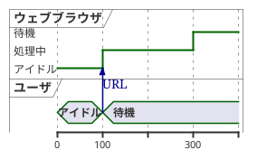
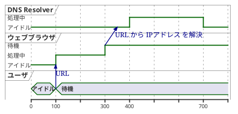
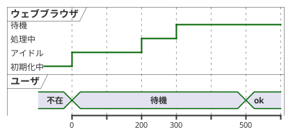
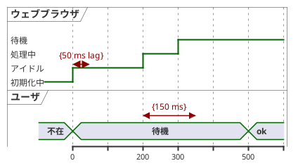
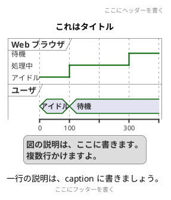
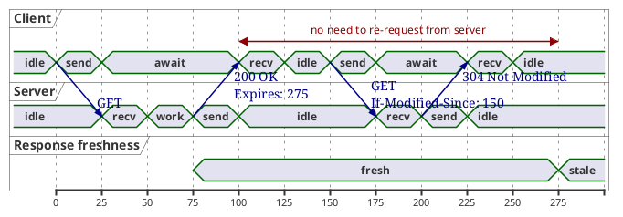

```plantuml
@startuml
robust "ウェブブラウザ" as WB
concise "ユーザ" as WU

@0
WU is アイドル
WB is アイドル

@100
WU -> WB : URL
WU is 待機
WB is 処理中

@300
WB is 待機
@enduml
```

# 相対時間での指定

```plantuml
@startuml
robust "DNS Resolver" as DNS
robust "ウェブブラウザ" as WB
concise "ユーザ" as WU

@0
WU is アイドル
WB is アイドル
DNS is アイドル

@+100
WU -> WB : URL
WU is 待機
WB is 処理中

@+200
WB is 待機
WB -> DNS@+50 : URL から IPアドレス を解決

@+100
DNS is 処理中

@+300
DNS is アイドル
@enduml
```

# 初期状態を表現

```plantuml
@startuml
robust "ウェブブラウザ" as WB
concise "ユーザ" as WU

WB is 初期化中
WU is 不在

@WB
0 is アイドル
+200 is 処理中
+100 is 待機

@WU
0 is 待機
+500 is ok
@enduml
```

# タイムラインとは別に時間を表現

```plantuml
@startuml
robust "ウェブブラウザ" as WB
concise "ユーザ" as WU

WB is 初期化中
WU is 不在

@WB
0 is アイドル
+200 is 処理中
+100 is 待機
WB@0 <-> @50 : {50 ms lag}

@WU
0 is 待機
+500 is ok
@200 <-> @+150 : {150 ms}
@enduml
```

# コメントとか

```plantuml
@startuml
Title これはタイトル
header: ここにヘッダーを書く
footer: ここにフッターを書く
legend
図の説明は、ここに書きます。
複数行かけますよ。
end legend
caption 一行の説明は、caption に書きましょう。

robust "Web ブラウザ" as WB
concise "ユーザ" as WU

@0
WU is アイドル
WB is アイドル

@100
WU is 待機
WB is 処理中

@300
WB is 待機
@enduml
```

```plantuml
@startuml
concise "Client" as Client
concise "Server" as Server
concise "Response freshness" as Cache

Server is idle
Client is idle

@Client
0 is send
Client -> Server@+25 : GET
+25 is await
+75 is recv
+25 is idle
+25 is send
Client -> Server@+25 : GET\nIf-Modified-Since: 150
+25 is await
+50 is recv
+25 is idle
@100 <-> @275 : no need to re-request from server

@Server
25 is recv
+25 is work
+25 is send
Server -> Client@+25 : 200 OK\nExpires: 275
+25 is idle
+75 is recv
+25 is send
Server -> Client@+25 : 304 Not Modified
+25 is idle

@Cache
75 is fresh
+200 is stale
@enduml
```
