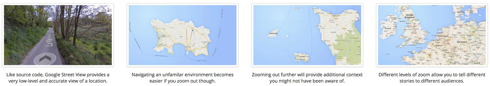
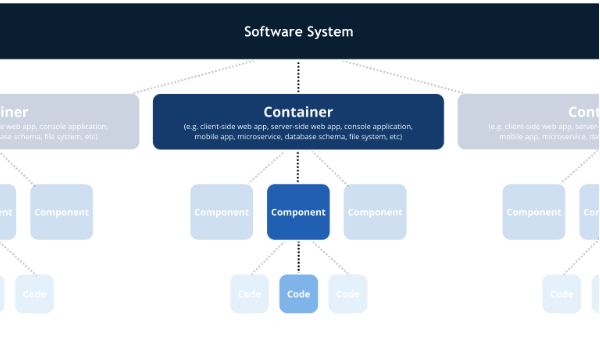
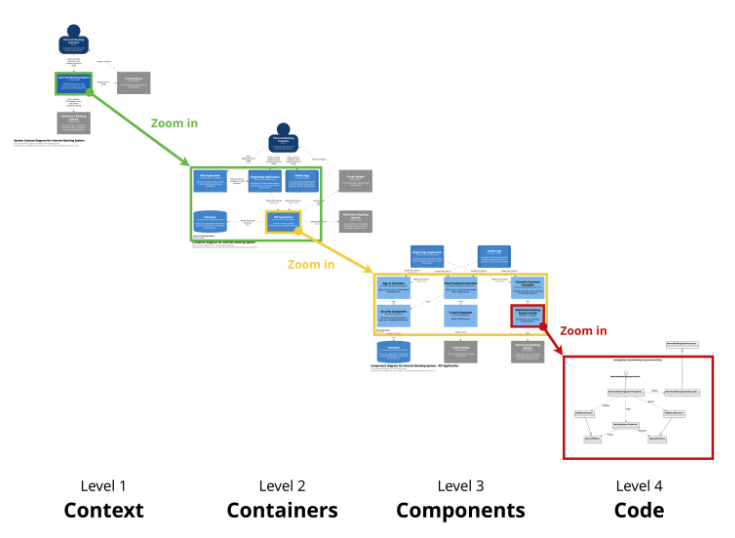

０# ソフトウェアアーキテクチャのためのC4モデル
* C4はコンテキスト（context）、コンテナ（containers）、コンポーネント（components）、コード（code）の略です。ソフトウェアアーキテクチャを様々な表示倍率で記述するための一連の階層図で、それぞれが（関心の）異なる聞き手に有用です。
* The C4 model is an "abstraction-first" approach to diagramming software architecture, based upon abstractions that reflect how software architects and developers think about and build software.


## 重要なポイント
* アジャイル方法論への移行の結果として、ソフトウェアに関する図を作成することは縮小されています。図を作成したとしても、混乱と不明瞭さをしばしば抱えています。
* C4モデルは、コンテキスト、コンテナ、コンポーネント、コードといった一連の階層的なソフトウェアアーキテクチャ図で構成されています。
* C4モデルの階層構造は、異なるレベルの抽象化を提供するとともに、それぞれが異なる関心の聞き手に直結しています。
* 使用する表記法の凡例だけでなく十分な量のテキストを含めることで、図の曖昧さを回避できます。
-------------------------------------------------

* ソフトウェアアーキテクチャ図（ダイアグラム）は、ソフトウェアシステムを構築するための設計（事前設計）や既存ソフトウェアシステムの仕組み（ふりかえりの文書化や知見の共有、学び）を伝える手段として素晴らしいものです。

### コードを GoogleMap のアナロジーから考える


* ミクロからマクロへ view を変えていく
* code, components, containers, context のように、視座の異なる図を用意する





# ライブラリはこちら
https://github.com/RicardoNiepel/C4-PlantUML

## C4_Elements

```plantuml

@startuml C4_Elements
!includeurl https://raw.githubusercontent.com/RicardoNiepel/C4-PlantUML/release/1-0/C4_Container.puml

Person(jkAlias, "JK", "Optional Description")
Person(ossanAlias, "おっさん", "Optional Description")

Container(containerAlias, "耳かき", "Technology", "Optional Description")

System(systemAlias, "散歩", "Optional Description")

' 関係線'
Rel(jkAlias, containerAlias, "Label", "Optional Technology")
Rel(ossanAlias, containerAlias, "Label", "Optional Technology")

Rel(jkAlias, systemAlias, "Label", "Optional Technology")
Rel(ossanAlias, systemAlias, "Label", "Optional Technology")

@enduml
```
