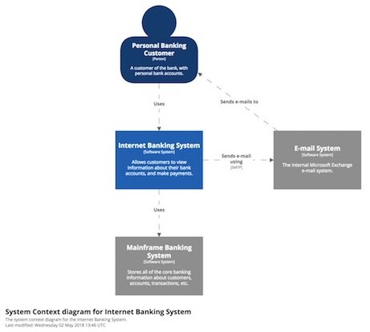

### Lv1. システムコンテキスト図

* 図やドキュメントを作成する際の、スターティングポイントになる
* ビッグピクチャーを見せるための図なので、詳細は重要じゃない
* non-technical people に見せるための図
* フォーカスは people や software system であり、プロトコルなどの low-level なテクノロジーではない

* 構築しようとしているソフトウェアシステムが、それを使用する人や関連する他システムとの相互作用の観点からどのような位置づけにあるのかを図示

* 対象のシステムを真ん中のボックスとして描く
* 上記システムの周りを、ユーザーと他のシステムが囲っている感じ

#### Intended audience
* Everybody, both technical and non-technical people, inside and outside of the software development team.

* 図中の色分けは、どれが既存のソフトウェアシステム（灰色の箱）で、どれが構築するソフトウェアシステム（青色の箱）かを示しています。
* 銀行の個人顧客は、銀行口座に関する情報を参照したり、支払いを行うためにインターネットバンキングシステムを利用します。
* インターネットバンキングシステムは、銀行が従来からもつメインフレームバンキングシステムを通してこれを処理し、そして電子メールシステムから顧客に電子メールを送信します。
