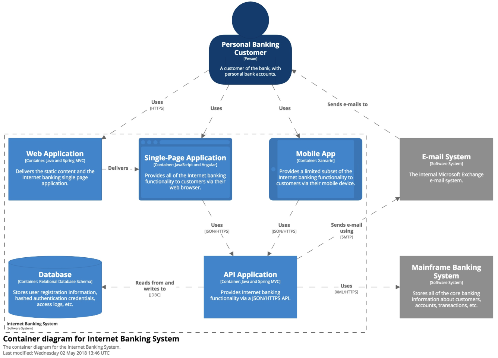

### Lv2. コンテナ図
* ソフトウェアシステムを拡大したもの
* ここでいうコンテナとは、内部であるコードが実行されたり、あるデータが格納されたりしている「コンテキストまたは境界のこと」
* 各コンテナは個別にデプロイ可能/実行可能なものまたは runtime environment
* 通常、自身のプロセススペース内で稼働する
* コンテナ間の交信は、通常 inter-process communication というかたちをとる

* the high-level shape of the software architecture and how responsibilities are distributed across it.
* It also shows the major technology choices and how the containers communicate with one another.
* This diagram says nothing about deployment scenarios, clustering, replication, failover, etc.

#### Intended audience
* Technical people inside and outside of the software development team; including software architects, developers and operations/support staff.

#### Server-side web application
* A Java EE web application running on Apache Tomcat
* an ASP.NET MVC application running on Microsoft IIS
* a Ruby on Rails application running on WEBrick
* a Node.js application, etc.

#### Client-side web application
* A JavaScript application running in a web browser using Angular, Backbone.JS, jQuery, etc.

#### Client-side desktop application
* A Windows desktop application written using WPF
* an OS X desktop application written using Objective-C
* a cross-platform desktop application written using JavaFX, etc.

#### Mobile app
* An Apple iOS app
* an Android app

#### Server-side console application
* A standalone (e.g. "public static void main") application, a batch process, etc.

#### Microservice
* A single microservice, hosted in anything from a traditional web server to something like Spring Boot, Dropwizard, etc.

#### Serverless function
* A single serverless function (e.g. Amazon Lambda, Azure Function, etc).

#### Database
* A schema or database in a relational database management system
* document store, graph database, etc
* MySQL, Microsoft SQL Server, Oracle Database, MongoDB, Riak, Cassandra, Neo4j, etc.

#### Blob or content store
* A blob store (e.g. Amazon S3, Microsoft Azure Blob Storage, etc)
* or content delivery network (e.g. Akamai, Amazon CloudFront, etc).

#### File system
* A full local file system or a portion of a larger networked file system (e.g. SAN, NAS, etc).

#### Shell script
* A single shell script written in Bash, etc.

