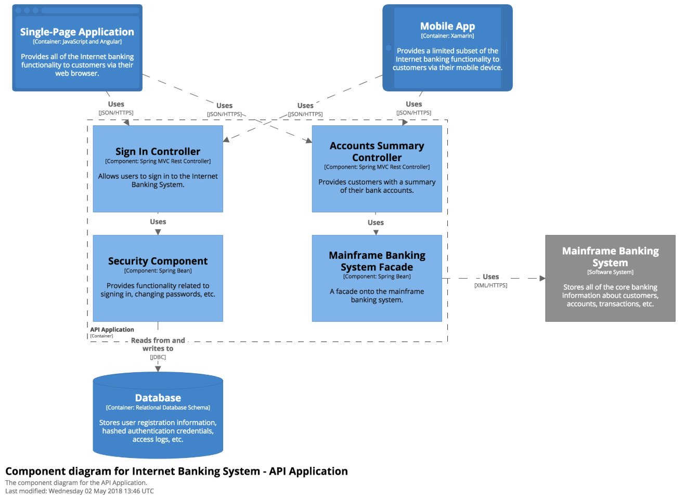

### Lv3. コンポーネント図
* decompose each container further to identify the major structural building blocks and their interactions.

* shows how a container is made up of a number of "components", what each of those components are, their responsibilities and the technology/implementation details.

* これらのコンポーネントは、コードベースのなかの実際の抽象概念（たとえば、コードのグループ化など）にマップしなければいけません。

* C4 の文脈におけるコンポーネントは、あるインターフェイスの背後にカプセル化された関連機能をグループ化したもの
* Java や C# における、a collection of implementation classes behind an interface
* あるコンテナ内のすべてのコンポーネントは同じプロセススペース内で実行される

* APIアプリケーション内のコンポーネントの一部
* 2つのSpring MVC RESTコントローラは、JSON/HTTPS APIのためのアクセスポイントを提供し、その後データベースやメインフレームバンキングシステムと通信するための他のコンポーネントを利用します。
