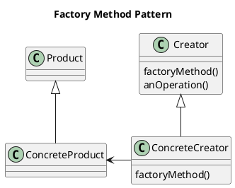
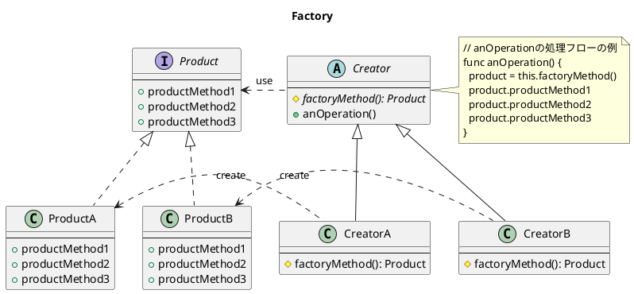

# Factory Method Pattern とは
* a creational pattern である
* Factory Method を使って、クラスを指定せずに OBJ を生成する問題を解決する。。。どういうこと？
* Factory Method を呼んで OBJ を生成する
* Factory Method のパターン1 →インターフェイスで特定して、その子クラスで実装する
* パターン2 →ベースクラスで実装され、オプションとして、それを継承したクラスがオーバライドする
* コンストラクタを呼んで生成したりしない

* Product インターフェイスを実装した Product クラスのインスタンスを生成して返す
* どの Product クラスをインスタンス化するかはサブクラスで決定する
* Product の利用者は、Product インターフェイスのみを関知する。具体Productについては関知しない

## Product
* 全ての Products が同じインターフェイスを実装する
* 結果、Products を使う全てのクラスが(具体クラスではなく)インターフェイスを参照することができる

## Creator
* Products を操作するための全てのメソッドの実装を含んでいる
* ただし、FactoryMethod だけは含まない
* 全てのCreator のサブクラスは、抽象 FactoryMethod() を実装しなければならない

## ConcreteCreator
* FactoryMethod() を実装する
*  →Products を生成する
* Concrete Products を生成することに責任を持つ
* Concrete Creator のみが、Products を作成する方法を知っている

